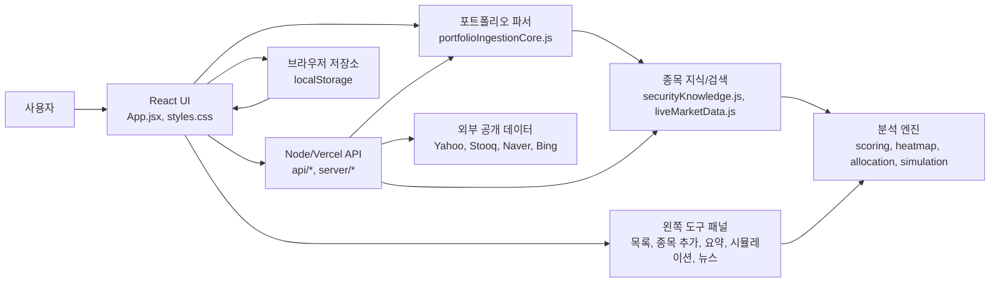
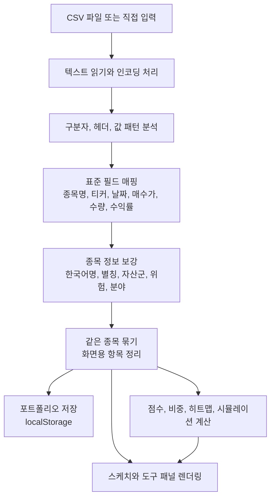

# AtomFolio

한국 투자자가 CSV 파일이나 직접 입력한 보유 종목을 기반으로 포트폴리오를 만들고, 수익 흐름, 비중, 점수, 투자 시나리오, 최신 시장 뉴스를 한 화면에서 확인할 수 있는 웹 애플리케이션입니다.

AtomFolio는 단순한 CSV 뷰어가 아니라 서로 다른 증권사 파일과 사용자가 직접 만든 투자 데이터를 읽어 포트폴리오 단위로 정리하고, 한국어 종목명과 줄임말 검색까지 고려해 실제 사용 흐름에 맞춘 투자 분석 화면을 제공합니다.

## 바로가기

- GitHub 저장소: [https://github.com/amuldi/AtomFolio--](https://github.com/amuldi/AtomFolio--)
- 기획서 PDF: [docs/proposal/AtomFolio_Plus_Proposal.pdf](docs/proposal/AtomFolio_Plus_Proposal.pdf)
- 핵심 규칙 문서: [Skills.md](Skills.md)

## 목차

1. [프로젝트 개요](#프로젝트-개요)
2. [실행 화면](#실행-화면)
3. [제작 과정과 노력](#제작-과정과-노력)
4. [주요 기능](#주요-기능)
5. [도구 상세 설명](#도구-상세-설명)
6. [아키텍처](#아키텍처)
7. [데이터 처리 흐름](#데이터-처리-흐름)
8. [실행 방법](#실행-방법)
9. [파일 구조](#파일-구조)
10. [검증](#검증)

## 프로젝트 개요

| 항목 | 내용 |
| --- | --- |
| 프로젝트명 | AtomFolio |
| 목적 | 투자 데이터를 포트폴리오 단위로 정리하고 시각적으로 분석 |
| 주요 사용자 | 국내외 주식, ETF, 리츠, 금/현금성 자산을 함께 관리하는 한국 투자자 |
| 입력 방식 | CSV/TSV/TXT 파일 가져오기, 직접 종목 입력, 포트폴리오 생성 |
| 핵심 출력 | 보유 종목 스케치, 날짜별 손익률, 포트폴리오 점수, 비중, 투자 시뮬레이션, 시장 뉴스 |
| 프런트엔드 | React 18, Vite |
| 백엔드 | Node.js HTTP API, Vercel Functions |
| 외부 데이터 | Yahoo Finance, Stooq, Naver/Bing 뉴스 fallback |
| 저장 방식 | 브라우저 localStorage 기반 포트폴리오 유지 |

## 실행 화면

### 메인 포트폴리오 화면

보유 종목을 중앙 코어와 주변 종목 노드로 배치해 포트폴리오 구성을 한눈에 볼 수 있게 만들었습니다. 왼쪽 사이드 도구는 기본으로 항상 보이고, 필요한 도구를 누르면 패널이 확장됩니다.


### 요약 도구

카테고리 필터, 날짜별 손익률, 포트폴리오 점수, 포트폴리오 비중을 한 패널 안에서 확인할 수 있습니다.


### 투자 시뮬레이션

시장 충격, 스트레스 테스트, 리밸런싱 목표, 장기 적립식 투자 가정을 입력해 예상 변화를 계산할 수 있습니다. 입력하지 않은 값은 임의로 계산하지 않고 예시 placeholder로만 보여줍니다.


### 시장 뉴스

오늘 날짜 뉴스가 없으면 가장 최신 주식 뉴스를 보여주도록 fallback을 구성했습니다. 카드에는 제목, 출처, 시간만 남겨 빠르게 훑을 수 있게 했습니다.


## 제작 과정

### 1. 실제 한국 투자 데이터에 맞춘 문제 정의

처음 목표는 “CSV를 올리면 보기 좋은 화면으로 바꿔주는 앱”이었지만, 실제 투자 CSV를 다루면서 문제가 더 구체화되었습니다. 증권사마다 컬럼명이 다르고, 같은 의미도 `종목명`, `상품명`, `자산명`, `ticker`, `symbol`처럼 다르게 표현됩니다. 국내 파일은 한글 인코딩 문제도 있고, 계좌명과 종목명이 섞여 들어오는 경우도 있습니다.

그래서 사용자가 파일을 앱에 맞춰 고치는 방식이 아니라, 앱이 들어오는 데이터를 최대한 이해하는 방향으로 설계를 잡았습니다.

### 2. CSV 구조 자동 추론 구현

고정 템플릿을 요구하지 않기 위해 컬럼명과 값 패턴을 함께 분석했습니다. 예를 들어 날짜처럼 생긴 값, 수익률처럼 생긴 값, 종목명처럼 생긴 값, 포트폴리오명처럼 생긴 값을 분리해 점수를 매기고 가장 가능성이 높은 필드로 매핑합니다.

이 과정에서 단순 문자열 비교만으로는 부족했습니다. `미국`, `기술`, `고위험`, `주식` 같은 분류 값이 종목명으로 잘못 잡히는 문제가 있어, 분류어와 종목명 후보를 구분하는 규칙을 따로 만들었습니다.

### 3. 한국어 종목 검색 개선

한국 사용자가 실제로 입력하는 방식에 맞추기 위해 한글, 영문, 티커, 줄임말을 모두 검색 대상으로 만들었습니다. 예를 들어 `삼성전자`, `삼전`, `Samsung`, `005930`처럼 다른 표현으로 입력해도 같은 종목을 찾을 수 있도록 로컬 종목 사전과 외부 검색 결과를 함께 사용합니다.

ETF도 `타이거`, `TIGER`, `KODEX`, `미국S&P500`처럼 한국 투자자에게 익숙한 표현을 우선 고려했습니다. 금도 투자 자산으로 추가해 주식뿐 아니라 금/현금성 포지션까지 포트폴리오 안에서 다룰 수 있게 했습니다.

### 4. 수동 입력과 실시간 시세 연결

CSV가 없어도 포트폴리오를 만들 수 있도록 직접 종목 추가 흐름을 만들었습니다. 종목을 선택하면 오른쪽 상세 패널에서 시세와 차트를 보고, 현재가를 매수가에 적용할 수 있습니다.

매수가를 직접 입력하거나 현재가를 적용하면 현재 시세 기준 수익률이 자동 계산되도록 연결했습니다. 이 기능은 사용자가 값을 따로 계산하지 않아도 입력 즉시 포트폴리오 상태를 맞출 수 있게 하기 위한 작업입니다.

### 5. 같은 종목 자동 묶기

같은 포트폴리오 안에 같은 종목이 여러 줄로 들어오는 경우가 있습니다. 매수일이 여러 번이거나 CSV가 거래 내역 단위일 때 특히 그렇습니다. AtomFolio는 투자 데이터 안의 같은 종목을 하나의 보유 종목으로 묶어 보여주고, 시계열 계산에는 원본 행을 유지합니다.

이렇게 화면에서는 중복 없이 깔끔하게 보이면서도, 날짜별 손익률 같은 분석에서는 원본 데이터의 흐름을 잃지 않도록 했습니다.

### 6. 도구 패널 UX 개선

초기에는 여러 패널이 화면을 많이 차지했습니다. 이후 사용 피드백에 맞춰 왼쪽 사이드에 도구 아이콘을 고정하고, 선택한 도구만 확장되는 구조로 바꿨습니다. 선택된 도구는 빛나게 표시하되 불필요한 네모 배경은 제거했습니다.

패널 너비, 글자 줄바꿈, 모바일 폭, 긴 버튼 텍스트, 히트맵 셀 크기까지 조정했습니다. 특히 `미래지향` 같은 글자가 세로로 떨어지거나 `...`으로 잘리는 문제를 줄이기 위해 패널과 버튼의 최소 폭을 다시 잡았습니다.

### 7. 투자 시뮬레이션 정리

초기 시뮬레이션 화면에는 임의 값이 기본으로 들어가 있었습니다. 사용자가 지정하지 않은 값을 앱이 결정한 것처럼 보이면 오해가 생기기 때문에, 현재는 입력 전 값은 비워두고 예시만 placeholder로 보여줍니다.

예상 변화는 투자 판단을 과하게 유도하지 않도록 초록색 강조를 제거하고 흰색 계열로 정리했습니다. 또한 화면에 보이는 용어는 포트폴리오와 투자 시뮬레이션 중심으로 통일했습니다.

### 8. 저장 유지와 재방문 흐름

만든 포트폴리오와 불러온 CSV는 브라우저 저장소에 저장됩니다. 사용자가 사이트를 다시 열어도 이전 포트폴리오를 바로 이어서 볼 수 있게 하기 위한 작업입니다.

## 주요 기능

### 파일 가져오기

- CSV, TSV, TXT 투자 파일을 가져올 수 있습니다.
- 파일마다 다른 컬럼명을 자동으로 분석합니다.
- UTF-8과 한국어 CSV에서 자주 쓰이는 인코딩을 고려합니다.
- 여러 포트폴리오를 저장하고 전환할 수 있습니다.

### 포트폴리오 생성

- CSV 없이도 포트폴리오명을 입력해 빈 포트폴리오를 만들 수 있습니다.
- 직접 종목을 추가해 포트폴리오를 구성할 수 있습니다.
- 저장된 포트폴리오는 다음 방문 시에도 유지됩니다.

### 종목 검색과 직접 입력

- 한글 종목명, 영문명, 티커, 한국식 줄임말 검색을 지원합니다.
- `타이거`처럼 브랜드명 일부만 입력해도 관련 ETF 후보를 보여줍니다.
- 주식을 선택하면 검색 후보창이 자연스럽게 닫힙니다.
- 종목명과 티커가 함께 채워지고, 시세 패널에서 현재가와 차트를 확인할 수 있습니다.
- 매수가 입력 또는 현재가 적용 시 수익률이 자동 계산됩니다.

### 실시간 시장 정보

- Yahoo Finance 차트 API를 우선 사용합니다.
- 일부 가격 정보는 Stooq quote fallback을 사용합니다.
- 한국 종목은 `.KS`, `.KQ` 형식을 함께 고려합니다.
- 외부 API 키 없이 동작하도록 구성했습니다.

### 최신 시장 뉴스

- 오늘 날짜 뉴스가 있으면 오늘 뉴스를 우선 보여줍니다.
- 오늘 뉴스가 없으면 가장 최신 주식 관련 뉴스를 보여줍니다.
- Naver Finance, Naver 검색, Bing News RSS를 조합해 fallback을 구성했습니다.
- 카드에는 설명문을 제거하고 제목, 출처, 시간만 표시합니다.

## 도구 상세 설명

왼쪽 사이드에는 다섯 개의 핵심 도구가 있습니다. 앱에 접속하면 사이드 도구는 항상 보이고, 아이콘을 누르면 해당 패널이 확장됩니다.

### 1. 포트폴리오 목록

포트폴리오를 만들고 관리하는 도구입니다.

- 파일 가져오기 버튼으로 CSV를 불러옵니다.
- 포트폴리오 생성 버튼으로 빈 포트폴리오를 만듭니다.
- 생성된 포트폴리오는 목록에 표시됩니다.
- 각 포트폴리오를 선택하면 해당 포트폴리오의 보유 종목과 점수, 비중이 다시 계산됩니다.
- 불필요한 포트폴리오는 삭제할 수 있습니다.

### 2. 종목 추가

직접 종목을 입력하고 현재 포트폴리오에 추가하는 도구입니다.

- 종목명 검색 입력창에서 한글, 영어, 줄임말, 티커 검색을 지원합니다.
- 후보를 선택하면 종목명과 티커가 자동 반영됩니다.
- 매수가, 보유수량, 수익률, 자산군을 입력할 수 있습니다.
- 시세가 확인되면 현재가와 차트가 오른쪽 상세 패널에 표시됩니다.
- 현재가 적용 버튼을 누르면 매수가에 현재가를 넣고 수익률을 현재 기준으로 다시 계산합니다.
- 여러 행을 임시로 쌓은 뒤 새 포트폴리오를 만들거나 현재 포트폴리오에 추가할 수 있습니다.

### 3. 요약

포트폴리오의 핵심 분석을 한 화면에 모은 도구입니다.

#### 카테고리 필터

- 투자 지역, 분야, 투자 스타일, 위험 등급으로 보유 종목을 필터링합니다.
- 선택한 필터는 사이드 아이콘과 보유 종목 스케치에 즉시 반영됩니다.

#### 날짜별 손익률

- 날짜별 수익률을 히트맵으로 보여줍니다.
- 최근 데이터가 오른쪽에 배치되어 흐름을 빠르게 볼 수 있습니다.
- 데이터가 많은 날짜는 더 밝게 표시됩니다.

#### 포트폴리오 점수

- 수익성, 수익 안정성, 투자 타이밍, 포트폴리오 구성, 위험관리, 분산투자를 레이더 차트로 계산합니다.
- 현재 포트폴리오 점수와 전체 포트폴리오 점수를 함께 볼 수 있습니다.
- 균형형, 미래지향, 안정형, 공격형 중 하나를 선택해 점수 가중치를 바꿀 수 있습니다.

#### 포트폴리오 비중

- 자산군 또는 종목 기준 비중을 도넛 차트로 보여줍니다.
- 명시적 비중 컬럼이 있으면 해당 값을 우선 사용합니다.
- 비중이 없으면 평가금액, 매수가와 수량, 균등 비중 순서로 계산합니다.

### 4. 투자 시뮬레이션

포트폴리오가 특정 시장 환경에서 어떻게 변할지 확인하는 도구입니다.

- 전체 시장, 미국 자산, 기술주, 금/현금, 리츠 충격 값을 직접 입력합니다.
- 기술주 급락, 금리 상승, 환율 급등, 글로벌 경기침체, 방어장세 같은 스트레스 테스트 버튼을 제공합니다.
- 목표 비중을 입력해 현재 비중과 비교할 수 있습니다.
- 월 추가 투자, 기간, 연평균 수익률을 넣어 장기 투자 결과를 계산합니다.
- 사용자가 값을 입력하지 않은 상태에서는 임의 계산을 하지 않고 예시만 보여줍니다.

### 5. 시장 뉴스

최신 주식 뉴스를 검색하고 확인하는 도구입니다.

- 기본 상태에서는 최신 주식 뉴스를 보여줍니다.
- 티커, 종목명, 테마, 날짜 키워드로 검색할 수 있습니다.
- 오늘 뉴스가 없으면 가장 최신 뉴스로 자동 대체합니다.
- 각 뉴스는 새 탭에서 원문으로 열 수 있습니다.

## 아키텍처



### 프런트엔드

- `src/App.jsx`가 전체 앱 상태, 사이드 도구, 포트폴리오 선택, 수동 입력, 저장 복원을 담당합니다.
- `src/styles.css`는 손그림 느낌의 어두운 UI, 도구 패널, 반응형 레이아웃을 담당합니다.
- `src/components/panels/`는 투자 시뮬레이션과 사이드 도구 패널을 담당합니다. 화면 문구는 투자 시뮬레이션과 포트폴리오 중심으로 정리되어 있습니다.

### 데이터 처리

- `src/lib/portfolioIngestionCore.js`는 CSV 구조를 분석하고 표준 포트폴리오 항목으로 변환합니다.
- `src/lib/securityKnowledge.js`는 종목명, ETF 브랜드, 한국식 줄임말, 자산 분류를 보강합니다.
- `src/lib/portfolioScoring.js`, `src/lib/portfolioHeatmap.js`, `src/lib/portfolioAllocation.js`와 시뮬레이션 계산 모듈은 각각 점수, 날짜별 손익률, 비중, 투자 시나리오 계산을 담당합니다.

### 서버와 API

- `server/index.mjs`는 로컬 개발용 API 서버입니다.
- `api/portfolio/ingest.js`는 파일 텍스트를 받아 포트폴리오 데이터로 변환합니다.
- `api/market/live.js`, `api/market/search.js`, `api/market/news.js`는 시세, 종목 검색, 시장 뉴스를 제공합니다.
- Vercel 배포 환경에서는 `api/*`가 서버리스 함수로 동작합니다.

## 데이터 처리 흐름



## 실행 방법

### 요구 환경

- Node.js 20 이상 권장
- npm

### 설치

```bash
npm install
```

### 로컬 개발 서버 실행

```bash
npm run dev -- --host 127.0.0.1 --port 5175
```

Vite가 포트 충돌을 감지하면 다음 포트로 자동 이동합니다. 로컬 API 서버는 기본적으로 `127.0.0.1:8787`에서 동작합니다.

### 프로덕션 빌드

```bash
npm run build
```

### 정적 빌드 미리보기

```bash
npm run preview
```

## 파일 구조

필요한 핵심 구조만 정리했습니다.

```text
.
├── README.md
├── package.json
├── vite.config.js
├── vercel.json
├── index.html
├── api/
│   ├── _utils/http.js
│   ├── health.js
│   ├── market/
│   │   ├── live.js
│   │   ├── news.js
│   │   └── search.js
│   ├── portfolio/ingest.js
│   └── securities/enrich.js
├── server/
│   ├── dev.mjs
│   ├── index.mjs
│   ├── portfolioIngestion.mjs
│   └── securityEnrichment.mjs
├── src/
│   ├── App.jsx
│   ├── main.jsx
│   ├── styles.css
│   ├── components/
│   │   ├── allocation/
│   │   ├── atom/
│   │   ├── cards/
│   │   ├── icons/
│   │   └── panels/
│   ├── constants/
│   ├── hooks/
│   ├── lib/
│   │   ├── liveMarketData.js
│   │   ├── marketNews.js
│   │   ├── portfolioAllocation.js
│   │   ├── portfolioHeatmap.js
│   │   ├── portfolioIngestionCore.js
│   │   ├── portfolioScoring.js
│   │   └── securityKnowledge.js
│   └── utils/
├── samples/portfolio/
└── docs/
    ├── assets/
    └── proposal/
```

## 검증

이번 README 재작성과 화면 캡처 기준으로 아래를 확인했습니다.

- `npm run build`
- 실제 로컬 앱을 headless Chrome으로 열어 화면 캡처 생성
- 요약 도구, 투자 시뮬레이션, 시장 뉴스 패널 렌더링 확인
- 최신 뉴스 fallback 동작 확인
- 화면 문구에서 설명문과 불필요한 용어가 남지 않도록 확인


## 주의사항
- 외부 시세와 뉴스는 공개 엔드포인트를 사용하므로 네트워크 상태나 서비스 정책에 따라 응답이 제한될 수 있습니다.
- 투자 시뮬레이션은 사용자가 입력한 가정 기반의 계산 도구이며 투자 조언이 아닙니다.
