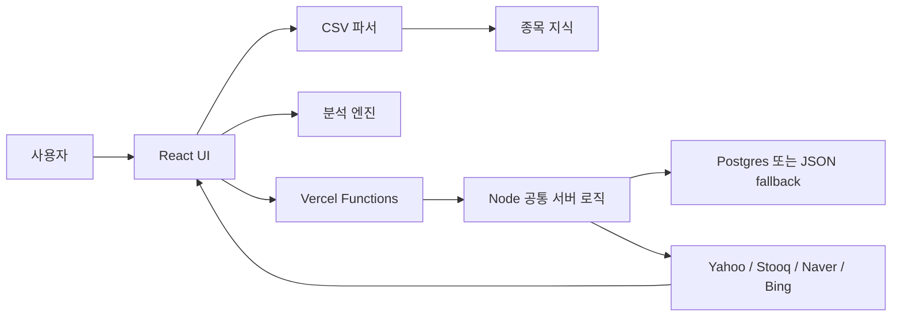
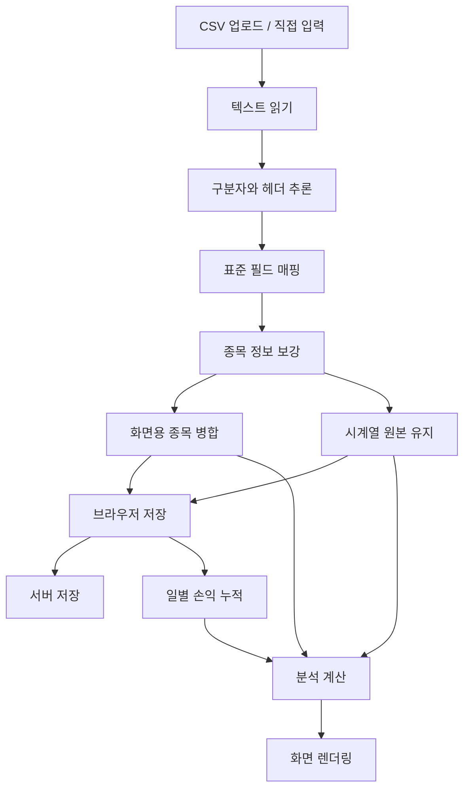

# AtomFolio 기획서

## 1. 프로젝트 개요

AtomFolio는 투자 CSV와 직접 입력한 보유 종목을 포트폴리오 단위로 정리하고, 손익 흐름, 자산 비중, 포트폴리오 점수, 투자 시뮬레이션, 시장 뉴스를 한 화면에서 확인할 수 있게 만든 웹 애플리케이션이다.

서비스의 출발점은 “투자 종목이 표 안에 갇혀 있으면 전체 구조가 보이지 않는다”는 문제였다. 사용자가 처음 그린 손그림처럼, 포트폴리오를 중심에 두고 각 종목이 원자처럼 뻗어나가는 구조를 웹 화면으로 구현하는 것이 핵심 컨셉이다.

- 서비스명: AtomFolio
- 배포 주소: https://atomfolio.vercel.app
- 저장소: https://github.com/amuldi/AtomFolio
- 주요 기술: React, Vite, JavaScript, Node.js, Vercel, Postgres
- 핵심 입력: CSV/TSV/TXT, 직접 입력 종목, 실시간 시세 검색
- 핵심 출력: 원자형 포트폴리오, 날짜별 손익 히트맵, 자산 비중, 점수, 시뮬레이션, 뉴스

## 2. 문제 정의

개인 투자자가 보유 종목을 분석하려고 하면 다음 문제가 반복된다.

1. 증권사마다 CSV 컬럼명이 다르다.
2. 국내 종목, 미국 종목, ETF, 금, 현금성 자산의 표현 방식이 다르다.
3. 같은 종목이 매수일이나 평가일 단위로 여러 줄 반복된다.
4. 날짜별 손익 데이터와 현재 보유 종목 데이터가 섞인다.
5. 수익률, 손실률, 평가금액, 비중이 파일마다 다른 형식으로 들어온다.
6. 사용자가 파일을 앱에 맞추는 과정 자체가 번거롭다.
7. 포트폴리오를 저장해도 시간이 지나며 손익 데이터가 누적되지 않으면 흐름 분석이 어렵다.

AtomFolio는 사용자가 CSV를 고치는 대신 앱이 CSV 구조를 해석하도록 설계했다. 화면은 표 중심이 아니라 포트폴리오 구조를 먼저 보여주고, 분석 도구는 필요할 때 왼쪽 패널에서 펼치는 방식으로 정리했다.

## 3. 목표 사용자

### 개인 투자자

국내 주식, 미국 주식, ETF, 리츠, 금/현금성 자산을 함께 보유하고 있고, 보유 종목을 한 화면에서 확인하고 싶은 사용자.

### 투자 기록을 직접 관리하는 사용자

증권사 앱 화면이 아니라 CSV, 직접 입력, 자체 정리 파일을 기반으로 포트폴리오를 추적하고 싶은 사용자.

### 데이터 분석 입문자

투자 CSV를 시각화하고 싶지만 파일 구조가 일정하지 않아 전처리에서 막히는 사용자.

## 4. 핵심 가치

| 가치 | 내용 |
| --- | --- |
| 자동 해석 | 고정 양식 없이 CSV 컬럼과 값 패턴을 분석한다. |
| 시각화 | 종목을 원자형 노드로 보여줘 포트폴리오 구조를 바로 파악한다. |
| 저장 지속성 | 브라우저 저장과 서버 저장을 함께 사용한다. |
| 날짜 누적 | 마지막 저장 이후 지난 날짜만큼 손익 스냅샷을 자동 생성한다. |
| 한국 투자자 UX | 수익은 빨간색, 손실은 파란색으로 표현한다. |
| 확장성 | Vercel Functions와 Postgres 저장소로 배포 환경을 분리한다. |

## 5. 기능 범위

### 5.1 포트폴리오 생성

- CSV/TSV/TXT 파일 업로드
- 빈 포트폴리오 직접 생성
- 현재 포트폴리오에 직접 종목 추가
- 여러 포트폴리오 저장과 전환
- 포트폴리오 삭제
- 업로드 이력 저장

### 5.2 CSV 자동 추론

- 헤더 후보 탐색
- 구분자 분석
- 종목명, 티커, 날짜, 매수가, 수량, 수익률, 비중, 계좌 정보 추론
- 분류값과 종목명 오인 방지
- 원본 행과 화면 표시용 데이터 분리

### 5.3 종목 검색과 보강

- 한글명, 영문명, 티커, 한국식 줄임말 검색
- ETF 브랜드와 자산 키워드 처리
- 지역, 분야, 투자 스타일, 위험 등급, 자산군 보강
- Yahoo Finance와 Stooq 기반 시세 조회

### 5.4 분석 도구

- 그룹 필터: 지역, 분야, 스타일, 위험 등급
- 날짜별 손익 히트맵
- 포트폴리오 점수 레이더
- 자산 비중 도넛
- 투자 시뮬레이션
- 시장 뉴스 검색

### 5.5 설정

설정은 필수 항목만 남긴다.

| 항목 | 옵션 |
| --- | --- |
| 언어 | 한국어, 영어 |
| 기준 통화 | KRW, USD |
| 날짜 기준 | 한국 시간, 내 기기 시간 |
| 자동 저장 | 켜짐, 꺼짐 |
| 일별 손익 누적 | 켜짐, 꺼짐 |
| 저장 상태 | 마지막 저장, 서버 동기화 |

## 6. 화면 설계

### 6.1 메인 화면

메인 화면은 원자형 포트폴리오를 중심으로 한다.

- 중앙 노드: 현재 포트폴리오
- 주변 노드: 보유 종목
- 라벨: 종목명과 수익률
- 인터랙션: hover 카드, 선택 강조, 3D 회전감
- 왼쪽 도구: 포트폴리오 목록, 종목 추가, 요약, 투자 시뮬레이션, 뉴스
- 오른쪽 상단: 설정

### 6.2 요약 패널

요약 패널은 분석 도구를 한 곳에 묶는다.

- 그룹 필터
- 손익 히트맵
- 포트폴리오 점수
- 자산 비중
- 주요 수익/손실 종목

### 6.3 투자 시뮬레이션

투자 시뮬레이션은 사용자가 직접 입력한 가정만 계산한다.

- 시장 충격 입력
- 스트레스 테스트
- 목표 비중 비교
- 월 추가 투자와 기간 입력
- 연평균 수익률 입력
- 예상 결과와 경고

### 6.4 뉴스 패널

뉴스 패널은 복잡한 설명문보다 최신 정보 접근성을 우선한다.

- 최신 주식 뉴스 기본 노출
- 검색어 기반 뉴스 조회
- 오늘 뉴스가 없으면 최신 뉴스 fallback
- 제목, 출처, 시간 중심 카드

## 7. 아키텍처

### 프런트엔드 구성

- `src/App.jsx`: 앱 전체 상태, 저장 복원, 설정, 원자형 화면, 도구 연결
- `src/styles.css`: 전체 디자인, 손익 색상, 반응형 레이아웃
- `src/lib/portfolioIngestionCore.js`: CSV 파싱과 필드 추론
- `src/lib/securityKnowledge.js`: 종목 별칭과 자산 분류
- `src/lib/portfolioHeatmap.js`: 날짜별 손익 히트맵
- `src/lib/portfolioAllocation.js`: 자산 비중 계산
- `src/lib/portfolioScoring.js`: 점수 계산
- `src/lib/digitalTwin.js`: 투자 시뮬레이션 계산

### 서버 구성

- `api/`: Vercel 서버리스 함수
- `server/index.mjs`: 로컬 개발 서버
- `server/portfolioStore.mjs`: 저장소 인터페이스
- `server/postgresPortfolioStore.mjs`: Postgres 저장소 구현
- `db/schema.sql`: 테이블 스키마

## 8. 데이터 흐름

### 일별 손익 누적 정책

1. 포트폴리오 저장 시 `savedAt`을 기록한다.
2. 다시 접속하거나 포커스가 돌아오면 마지막 저장일과 오늘 날짜를 비교한다.
3. 날짜가 지났으면 빠진 날짜를 모두 계산한다.
4. 각 날짜마다 현재 보유 종목을 스냅샷으로 추가한다.
5. 이미 같은 날짜와 종목 스냅샷이 있으면 추가하지 않는다.
6. 히트맵과 분석은 누적된 `timelineItems`를 사용한다.

## 9. 저장소 설계

### 브라우저 저장

- localStorage에 포트폴리오, 활성 포트폴리오, 마지막 저장 시각을 저장한다.
- 자동 저장이 꺼져 있으면 저장과 동기화를 일시 중지한다.
- 설정값도 localStorage에 저장한다.

### 서버 저장

- workspace id로 사용자 브라우저 단위 저장 공간을 분리한다.
- Postgres 환경에서는 `atomfolio_workspaces`, `atomfolio_portfolios`, `atomfolio_imports` 테이블을 사용한다.
- `DATABASE_URL`이 없으면 로컬 JSON fallback을 사용한다.

## 10. 색상 정책

한국 투자 앱에서 일반적으로 쓰는 규칙에 맞춰 손익 색상을 통일한다.

| 상태 | 색상 |
| --- | --- |
| 수익 | 빨간색 |
| 손실 | 파란색 |
| 중립 | 흰색/회색 계열 |

적용 대상:

- 원자 라벨 수익률
- hover 카드
- 손익 히트맵
- 도넛 중앙 총 수익률
- 보유 종목 지표
- 시장 시세 변동률
- 투자 시뮬레이션 결과

## 11. 구현 난점과 해결 방향

### CSV 추론

문제: 파일마다 컬럼명과 위치가 달라서 단순 파서로는 안정적으로 처리하기 어렵다.

해결: 컬럼명, 값 패턴, 숫자 형식, 날짜 형식, 종목명 단서를 함께 점수화한다.

### 종목명 오인식

문제: `미국`, `기술`, `고위험` 같은 분류값이 종목명으로 잡히는 경우가 있다.

해결: 분류어 사전과 ETF/티커 단서를 분리하고, 한국식 별칭을 별도 관리한다.

### 반복 행 처리

문제: 날짜별 수익률 파일은 같은 종목이 반복되어 화면 노드가 너무 많아진다.

해결: 화면용 데이터는 종목 단위로 묶고, 분석용 시계열은 `timelineItems`로 유지한다.

### 저장과 배포

문제: 로컬 개발 서버와 Vercel 서버리스 환경의 저장 방식이 다르다.

해결: 저장소 인터페이스를 만들고, Postgres와 JSON fallback을 분리한다.

## 12. API 범위

| API | 설명 |
| --- | --- |
| `GET /api/health` | 서버 상태와 저장소 상태 |
| `GET /api/market/live` | 실시간 시세와 차트 |
| `GET /api/market/search` | 종목 검색 |
| `GET /api/market/news` | 시장 뉴스 |
| `POST /api/portfolio/ingest` | CSV 텍스트 ingest |
| `GET /api/portfolio` | 포트폴리오 목록 |
| `POST /api/portfolio` | 포트폴리오 저장 |
| `PUT /api/portfolio/:id` | 포트폴리오 수정 |
| `DELETE /api/portfolio/:id` | 포트폴리오 삭제 |
| `GET /api/portfolio/imports` | 업로드 이력 |
| `POST /api/securities/enrich` | 종목 보강 |

## 13. 향후 개선

- 계정 기반 로그인
- 실제 사용자별 workspace 관리
- 벤치마크 수익률 비교
- PDF 투자 리포트 출력
- 다중 포트폴리오 비교
- 월별 수익률 분포와 최대 낙폭
- 목표 비중 기반 리밸런싱 추천

## 14. 결론

AtomFolio는 투자 데이터를 단순 표가 아니라 포트폴리오 구조로 보여주는 서비스다. 핵심은 CSV를 정해진 양식으로 맞추는 것이 아니라, 앱이 다양한 투자 데이터를 읽고 해석하는 데 있다.

현재 버전은 원자형 시각화, 직접 입력, 실시간 시세, 최신 뉴스, 일별 손익 누적, 자동 저장, Postgres 배포 구조까지 포함한다. 이를 통해 개인 투자자가 자신의 포트폴리오를 더 빠르게 이해하고, 시간이 지나며 손익 흐름을 추적할 수 있는 기반을 만든다.
