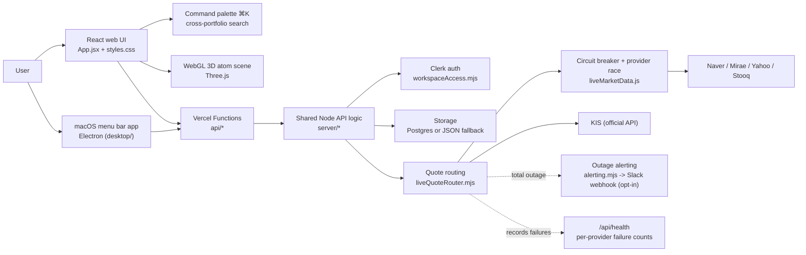
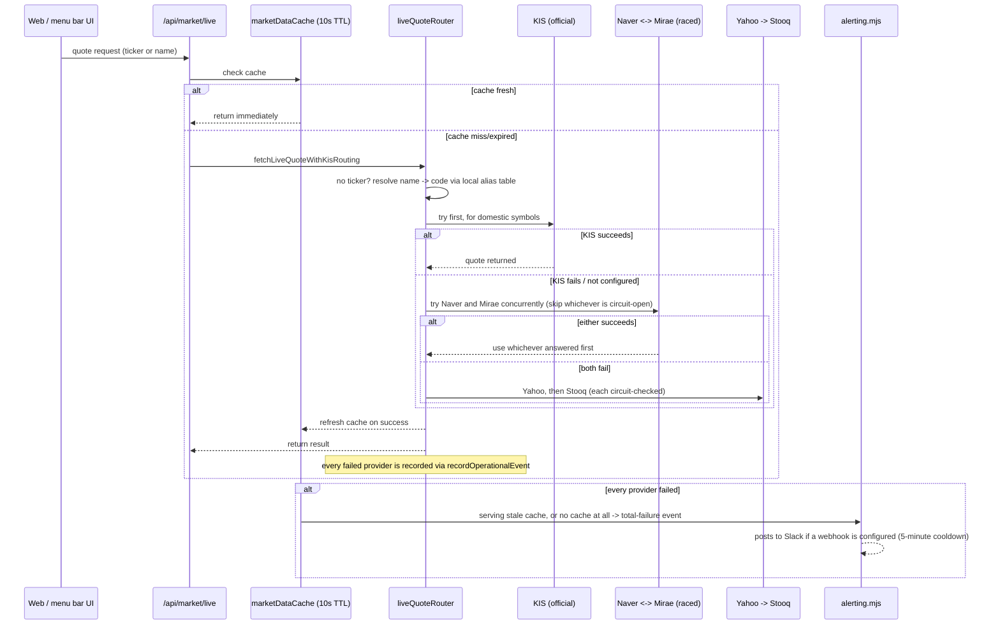

# AtomFolio Update Log

> This document does not replace [`README.md`](../../README.md). The README stays the reference
> for the app itself (how to run it, what it does, its architecture); this document is a **dated
> changelog**. The newest entry is at the top, and each entry carries screenshots actually
> captured from the app running locally at that point — nothing here is mocked up or imagined.
> This used to be a single "then vs. now" comparison document; from now on, a new entry is added
> above the rest for each meaningful batch of work. The old content wasn't deleted — it's kept
> below as the "baseline" entry.

## 2026-08-13 — Menu bar widget interaction polish (drag, click-through, category, sleep)

Done right after the baseline entry below, in the same stretch of work. These came out of actually
running the macOS menu bar widget and fixing what broke or was asked for — written up strictly
from the real commits, nothing invented.

### What changed

- **Idle rotation speed**: `AUTO_ROTATE_SPEED` 0.018 → 0.022 (~22%). Desktop widget only — the
  website has its own separate copy of this constant and is unaffected.
- **⌘-drag no longer sticks**: the root cause was the renderer never receiving pointer events once
  the cursor outran its own window. Replaced with the main process polling
  `screen.getCursorScreenPoint()` every 16ms while a drag is in flight, so the window tracks the
  cursor anywhere, including off-window and across displays. Releasing ⌘ mid-drag still stops it
  immediately, per the prior fix.
- **The widget now re-centers every time it's shown**: instead of restoring wherever a previous
  drag left it, showing the widget always repositions it to the primary display's center. This
  only worked when toggled off/on from the tray menu at first — a **separate bug** meant it didn't
  apply on a fresh app launch (`createAtomWidget` was bypassing `setAtomWidgetVisible`), fixed
  once found.
- **The info box overlapping the atom on click**: first patched with a semi-opaque backing plate,
  then redone properly after "remove the black box, still don't overlap" feedback —
  `.atom-visual-stage` now permanently reserves 52px of bottom padding, so the atom itself draws
  slightly smaller/higher and the info box has genuinely empty space to sit in.
- **Click-through for empty space around the widget**: the widget is a transparent window that
  never called `setIgnoreMouseEvents`, so clicking the empty margin around the atom ate the click
  instead of passing it to whatever app was behind. Fixed with a `document.elementFromPoint`
  hit-test — clicks pass through unless the cursor is actually over a node, the center, or the
  stage background while ⌘ (window-move) is held.
- **Category filter** (Settings → app settings): pick assetClass/region/sector/style/risk, and
  clicking a holding now **connects it with a solid line** to every other holding sharing that
  value (started out dashed, changed to solid per feedback). Same-category holdings stay at full
  opacity alongside the selected one instead of dimming with everything else.
- **Sleep mode**: makes the widget fully inert — it keeps floating and rotating, just stops
  reacting to the cursor at all, like a static desktop image. Started out as a settings-panel
  toggle, then moved to the tray icon's own right-click menu (next to "Show atom widget") per
  feedback that it didn't belong in Settings.

Verified: `npm run build:renderer && npm run build:main-libs` passes, lint clean, the web app's own
`npm run build`/`node --test` (78 tests) unaffected. Live interactive verification (actually
dragging fast, confirming click-through passes through, etc.) wasn't fully completed this round
due to environment constraints — noted honestly in the commit messages too. Flag it if anything
looks off in real use.

### Screenshots

The screenshots for this entry are being **captured and added by the user directly** — automated
capture kept picking up unrelated windows on a busy desktop, so this round wasn't automated. Drop
the files below into `docs/updates/assets/` and they'll render here automatically.

| File | Shows |
| --- | --- |
| `assets/atomfolio-tray-menu-2026-08-13.jpg` | Tray icon right-click menu (Show atom widget / Sleep checkboxes) |
| `assets/atomfolio-widget-dark-2026-08-13.jpg` | Atom widget, dark theme |
| `assets/atomfolio-widget-light-2026-08-13.jpg` | Atom widget, light theme (confirming the black atom is actually visible) |
| `assets/atomfolio-popover-news-2026-08-13.jpg` | Popover — news page |
| `assets/atomfolio-popover-settings-2026-08-13.jpg` | Popover — settings page (includes the category filter; sleep is no longer here) |

<!--
Uncomment once the files above exist:

-->

---

## 2026-08-13 — Market-data resilience + this update log's own creation (baseline)

> Everything below is the single "then vs. now" document that existed before this log switched to
> a dated-entry structure, moved here as-is rather than rewritten. Covers the cumulative changes
> from the very first commit up through when this entry was originally written.

### The short version

| Area | Then (earliest commits) | Now |
| --- | --- | --- |
| Auth | None — localStorage only | Clerk email/password login + guest-workspace promotion |
| Storage | localStorage only | localStorage + Postgres (Neon) / JSON-file fallback, isolated per workspace |
| Quote sources | Yahoo → Stooq, two-step fallback | KIS (official) → Naver/Mirae (raced concurrently) → Yahoo → Stooq, with a circuit breaker, per-provider failure tracking, and outage alerting |
| Atom visualization | Static SVG sketch lines | WebGL (Three.js) 3D scene, redesigned several times (node shape, bloom, transitions) |
| Navigation | Fixed sidebar icons | Command palette (⌘K) searching across every portfolio at once, a separate management table view |
| Platforms | Web only | Web + a macOS menu bar companion app (Electron) |
| Market news | Naver/Bing RSS only | + Finnhub (optional), pagination, caching, thumbnails |
| Observability | None | `/api/health` now reports per-provider failure counts, rate limits, cache state, and outage alerts |
| Tests | Almost none | 78 (`node --test`) — auth isolation, rate limiting, KIS routing, workspace-store contracts, etc. |

The sections below go into what each of these actually changed, concretely.

### Atom visualization & navigation

**At first**, this was a 2D SVG sketch that started from a hand-drawn concept — thin lines
radiating from a center, small circles at their ends, handwriting-style labels. The "then"
screenshot below (`docs/assets/atomfolio-dashboard.png`, from the earliest commits) shows exactly
that.

**Now**, it's a Three.js WebGL 3D scene, and the commit history shows this is where the most
iteration went:

- **A staged rewrite (Stage A→D)**: static rendering (A) → raycaster interaction + CSS2D labels
  (B) → always-on bloom + a detail panel (C) → a full-scene transition on portfolio switches (D).
  The first version of that transition was a "black hole absorbing the scene" effect; it was later
  redone as a "spaceship flying to the next portfolio" effect, which reads far more directionally
  clear.
- **Simplified node shape**: five tilted rings became a single wobbled icosphere gem — removing
  boxy shading artifacts and smoothing out the sphere shading along the way.
- **Command palette (⌘K)**: searching by name or ticker now returns matches **across every
  portfolio at once** (see the screenshot below) — originally, search only worked inside whichever
  portfolio was currently active.
- **A dedicated management table**: separate from the 3D scene, a plain table lets you edit name,
  ticker, cost basis, quantity, return, and asset class directly — bulk edits are far faster here
  than manipulating the 3D scene.
- **New-user onboarding**: an empty-state CTA and a ⌘K discoverability hint were added so a
  first-time visitor with no portfolio yet isn't just staring at an empty scene with no idea what
  to click.

### Auth & workspaces (an entirely new layer)

The original version had no concept of login at all — browser localStorage was the whole story,
and switching devices meant losing everything. Now:

- **Clerk**-backed email/password login exists (a custom UI drawn directly against Clerk's
  headless `useSignIn`/`useSignUp` hooks),
- you can still use the app instantly before logging in, under a `guest:<uuid>` workspace, and
  logging in migrates that guest data into the logged-in account's workspace
  (`/api/workspace/claim-guest`),
- the server verifies Clerk JWTs via `@clerk/backend`'s `verifyToken`, and there's a test proving
  one authenticated user genuinely cannot reach another owner's workspace
  (`a different authenticated user cannot access another owner workspace`),
- and storage itself went from localStorage-only to **Postgres (Neon), with a JSON-file fallback**.

### Live market-data reliability

This is where the session that wrote this entry concentrated. Starting from "how do we improve
quote data coverage and stability," five changes were actually implemented — **without spending
any money** (`src/lib/liveMarketData.js`, `server/marketData/liveQuoteRouter.mjs`,
`server/marketDataCache.mjs`, `server/alerting.mjs`).

| Problem | Before | Now |
| --- | --- | --- |
| Every request waited out a dead provider | If Naver was down, every single request paid its full timeout, every time | A provider that fails 3 times in a row is skipped for 30 seconds (circuit breaker) |
| Naver/Mirae tried one after another | Mirae was only tried **after** waiting for Naver to fail | Two independent sources are raced concurrently; whichever answers first wins (`raceQuoteAttempts`) |
| Provider failures were invisible | Only logged once, and only if every provider failed at once | Every provider failure is now recorded and shows up at `/api/health?details=events` as `provider-fail:naver`, etc. |
| Nobody knew about a total outage | Stale responses went out silently, no alert | `server/alerting.mjs` detects and records total outages, and can optionally push to a Slack webhook (`ATOMFOLIO_ALERT_WEBHOOK_URL`, free) |
| A name-only domestic lookup could never reach KIS | KIS was only tried when a ticker was present | A Korean name is now resolved to a KRX code via the offline local alias table first, so name-only lookups get a shot at KIS too |

All five changes make smarter use of **existing free/official sources** — none required a new paid
API contract. The test suite grew to 78 tests (including one new test), and the build and linter
both pass. The behavior is also documented in the README's "API abuse protection" section.

### CSV ingestion robustness

CSV auto-inference was always a core feature, but feeding it more real-world data surfaced (and
fixed) a handful of concrete bugs:

- **Holdings silently disappearing from the atom scene** due to a name-pattern re-check — fixed
  (`Fix stocks silently dropped from atom scene by name-pattern re-check`).
- **A stray `.manual.csv` suffix** being appended to manually-created portfolio names, even though
  the user had typed their own name — removed.
- **The date-basis setting not applying** to the heatmap and news timestamps — fixed.
- **`PortfolioAllocationCard` dropping its `className` prop**, which broke the allocation donut's
  layout — fixed.

### Light/dark mode — tried, then rolled back

At one point, the app genuinely had three theme settings: system, light, and dark. Several commits
went into fixing light-mode issues — the atom being nearly invisible against a light background,
halo and alpha-blending asymmetry — but the end state rolled all of it back to **dark-only**
(`Remove light/dark theme toggle entirely — dark is the only mode again`). Not a failure so much
as a conclusion reached through the experiment: a dark background is intrinsically a better fit
for what this app's atom visualization is trying to be.

> Note: this is the **website's** light/dark story. The **menu bar widget** still has its own
> system/light/dark theme setting, independent of this decision — which is why the entry above
> this one has a screenshot confirming the light theme's black atom is actually visible.

### An entirely new platform — the macOS menu bar companion app

AtomFolio started as a web app only. It now also has a **separate Electron project** under
`desktop/` — a macOS menu bar app that reuses the existing API (`/api/portfolio`,
`/api/market/news`) as-is, without touching any web/server code.

#### What it does

- An atom-shaped tray icon sits in the menu bar; clicking it opens a small floating widget showing
  your top holdings by weight **orbiting the portfolio total at the center**. Drag to spin the
  orbit, or leave it alone and it slowly auto-rotates.
- Clicking a single holding shows its market value, P/L, and weight; clicking again (or clicking
  the center) returns to the total.
- The tray icon itself changes color with your overall P/L direction — profit (red, following
  Korean investor convention), loss (blue), or neutral (`trayDot-profit.png` /
  `trayDot-loss.png` / `trayDot-neutral.png`, with @2x Retina variants) — deliberately *not* named
  as a macOS "Template" image, since macOS force-monochromes those and this app's entire point
  here is the color.
- The popover holds a news search and a settings page, swipeable between as pager cards.
- Holding-related news is polled every 60 seconds and surfaced as desktop notifications (not true
  real-time; the poll interval is hard-floored at 60 seconds so a misconfigured client can't hammer
  the shared API).
- There's no full OAuth login yet — it reuses the web app's existing guest/workspaceId system.
  Pasting the Workspace ID shown in the web app's Settings → Workspace screen connects it.

#### What got fixed along the way

The menu bar app went through its own round of iteration — a widget that vanished across
Spaces/fullscreen transitions, ⌘+drag not actually moving the window, a packaged build that
crashed silently with no window ever appearing, rotate/move gestures fighting each other. Each got
its own fix commit (the next round of drag/click-through/category/sleep work is in the entry
above). The build target is now scoped to Apple Silicon (arm64) only, for release stability.

#### Being upfront about how these screenshots were taken

The menu bar app is a native macOS tray widget, so it couldn't initially be captured with browser
automation. It was actually launched locally (`cd desktop && npm run dev`) and captured with
macOS's built-in `screencapture` command instead — the three images below are not mockups, they're
**the real tray widget and popover, actually running on macOS**, connected to a real local test
workspace (`portfolio_test2`, 11 holdings) over `localhost:8787`, with a live Naver market-news
feed showing through.

One thing worth being fully transparent about: an early attempt at this captured the *entire*
screen and picked up unrelated windows from other apps (a chat app conversation, a notes app) that
had nothing to do with this task. **That file was deleted immediately, without being saved,
attached, or shown anywhere.** Every capture after that point first hid unrelated apps (chat,
notes, Finder) via macOS's `System Events`, captured only the screen area the user pointed to (a
Chrome/Google window), and immediately restored those apps' visibility afterward. The images below
are cropped from those clean captures only.

**The atom widget** — an always-on-top floating window with top holdings orbiting the portfolio
total. The real Chrome window behind it (the AtomFolio GitHub repo, a YouTube tab) shows it's
genuinely floating over the desktop, not a mockup:

**The popover** (news / quick-add / settings pager) that opens from the tray icon — showing
`portfolio_test2 · 11 holdings` with a live Naver market-news feed:

**Both windows together**, floating over the Chrome/Google window the user pointed the capture at:

(Note: these three were captured before the info-box-overlapping-the-atom issue was fixed in the
entry above — see that entry's own screenshots for the current look.)

### Screenshots — then vs. now

#### The atom scene

**Then** (earliest commits, `docs/assets/atomfolio-dashboard.png`): thin sketch lines and small
circular nodes, with a fixed vertical rail of X/star/crown/hexagon/ring icons on the left.

**Now** (captured locally when this entry was written): the same "radiating from a center" concept
persists, but there's now an Explore/Manage tab pair and a command palette (⌘K) up top, and the
left icon rail has been reorganized into Portfolios / Search / Summary / Compare / Simulation /
News / Settings.

#### Summary tools (heatmap + portfolio score + allocation)

**Now**: category filters, service-analytics stats, a daily P/L heatmap, a 6-axis portfolio-score
radar, and an allocation donut all live in one panel.

#### Investment simulation

#### Market news (live Naver market-news feed, confirmed working)

#### Command palette (⌘K) — searching across every portfolio

The same holding name shows which portfolio it belongs to (`테스트계좌.manual`,
`demo-portfolio`, etc.), so holdings scattered across multiple portfolios can be found in one
search.

#### Settings

### Architecture — as of this entry

Redrawing the README's original architecture diagram with this entry's additions (circuit
breaker, provider racing, outage alerting, KIS name-based routing) and the new platform (the menu
bar app) layered in:

### Quote-lookup flow — the resilience layer added in this entry

## See also

- For the app itself, see [`README.md`](../../README.md).
- For running the menu bar app, see [`desktop/README.md`](../../desktop/README.md).
- The Korean version of this document: [`AtomFolio_Updates.md`](AtomFolio_Updates.md)
