# AtomFolio Update Log

> This document does not replace [`README.md`](../../README.md). The README stays the reference
> for the app itself (how to run it, what it does, its architecture); this document is a **dated
> changelog**. The newest entry is at the top, and each entry carries screenshots actually
> captured from the app running locally at that point — nothing here is mocked up or imagined.
>
> The dated entries below go all the way back to this project's **actual first commit
> (2026-04-27, `Add AtomFolio dashboard project`)**, built from `git log` — not treating "today"
> as the starting point. The April/May and early-July entries are summarized from commit messages;
> the August entries (especially August 13–14) are the detailed, live-verified write-ups from the
> sessions that actually did the work. Bugs found along the way are tracked separately in
> [`AtomFolio_Bugs.en.md`](AtomFolio_Bugs.en.md).

## 2026-08-15 — Atom widget drag reverted back to ⌘-required, plus a stuck-drag fix and a news-date fix

The entry right below this one moved the atom widget's drag to a plain grab-anywhere native OS
drag, aiming to piggyback on Mission Control's Space-switching. Living with it changed the call —
the widget is meant to stay on whichever single Space it's floating on, not follow the user to a
different Desktop mid-drag. The drag was reverted back to the earlier synthetic (IPC-polling) drag,
gated behind holding ⌘ (Command) again.

**Reverting it surfaced two real bugs, fixed in the same pass.**

1. **The widget moved on a plain grab, no ⌘ needed.** The ⌘ check the native-drag experiment had
   dropped never came back when the drag mechanism was reverted — restored `event.metaKey` in
   `handleWidgetDragStart`.
2. **A drag never ended — it just kept following the cursor.** The click-through hit-test's
   "is a drag in progress" check only ever looked at node-rotation drags (`dragRef`), never a
   widget-move drag. The drag starts from `.atom-section`'s own outer padding, which sits outside
   `.atom-visual-stage`'s actual bounds, so the cursor drifting there mid-drag flipped the window to
   click-through — and from that point on it stopped receiving mouse events entirely, including the
   `pointerup` that would have ended the drag. Added `widgetDragActiveRef` and folded it into the
   click-through's `dragInProgress`, and widened the interactive check so holding ⌘ counts on its
   own, regardless of whether the cursor is technically over `.atom-visual-stage`.

A narrow edge case turned up while fixing this and got cleaned up too — a ⌘-drag starting exactly
on a node or the center circle used to get swallowed by the rotate/select handler before the
window-move handler ever saw it. `handleNodePointerDown`/`handleCenterPointerDown` (and the shared
`onCenterPointerDown` callback in `src/components/atom/index.jsx`, used by both the web app and the
widget) now skip `stopPropagation()` when ⌘ is held, so a ⌘-drag moves the window no matter what
it starts on.

**Removed the news/settings shortcut buttons from the popover's summary page.** The summary page is
now just portfolio numbers; news and settings are still reachable via the pager's own swipe/dots,
the header's ⚙ button, and the widget's right-click menu.

**Fixed news dates showing one day ahead.** Naver News gives dates in KST with no timezone marker
(e.g. "2026.08.15. 23:45"), and `marketNews.js`'s `parsePublishedAt` was handing that straight to
`Date.parse()` — which resolves against the *host process's* timezone, and Vercel's serverless Node
runtime defaults to UTC. A naive-KST string read as UTC lands 9 hours later, which crosses into the
next UTC calendar day for anything published after ~3pm KST. Reproduced directly with
`TZ=UTC node -e "..."`, then fixed by parsing the numeric components and anchoring via
`Date.UTC(...) - 9h` (Korea has no DST, so a fixed offset is safe). Also widened the regex once
testing showed Naver's raw text normalizes to two different shapes depending on whether there's a
trailing period before the time. Added a regression test
(`tests/market-news-date.test.mjs`) that passes under both `TZ=UTC` and `TZ=Asia/Seoul`.

**Trimmed the portfolio list card down to just the portfolio name.** It used to also show either
"no account info" or an "N holdings · M rows" line beneath the name; after the user asked what
those meant (confirmed: "no account info" fires when the CSV never carried account metadata at
all, and "M rows" counts the dated repeat-rows behind the same holding), both were dropped as
unnecessary. The underlying `summarizePortfolioEntryAccounts()` computation is untouched since
other screens still read it — only this card's rendering was trimmed.

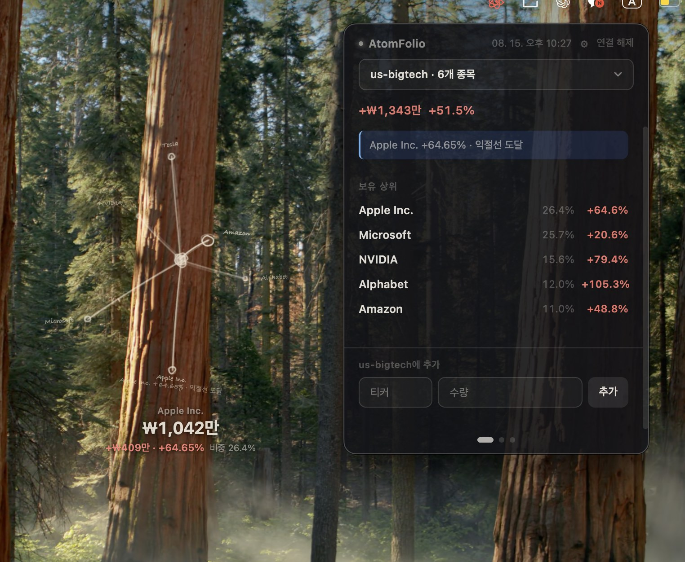

**Verified**: `npm run lint` clean (web + desktop), `npm test` 119 total — 118 pass, 1 skip
(pre-existing), 0 fail, desktop renderer/main-libs bundles rebuild clean, the compiled bundle
confirmed to contain both the ⌘ check and `widgetDragActiveRef`. The actual mouse-drag gesture
itself couldn't be reproduced live in this sandbox — verified by code reading and automated tests
only.

## 2026-08-15 — Menu bar app overhaul: summary-first popover, 5s fast sync, native drag for the atom widget

The menu bar companion app changed direction from "a small news-reading helper" to "a portfolio
control panel." Summarizing several rounds of work here.

**The popover now opens on a summary page.** It used to be a 2-page news/settings pager that
always opened on news; it's now a 3-page summary / news / settings pager (total value, today's
P/L, any active insight, top holdings by weight, quick-add) that always returns to summary on
open. Settings were regrouped from two groups (split by control type) into three grouped by
purpose: Basic (appearance/behavior), Alerts (every notification-triggering control), Advanced
(refresh cadence, category filter, popup opacity — collapsed by default via a native
`
`). Quick-add now names which portfolio it targets and shows a brief "✓ AAPL added"
confirmation instead of silently clearing. Along the way we found the widget's own readout and
the web dashboard were using different money formats — `formatKoreanWonShort` (the 억/만 compact
format) was promoted from a local copy in `DigitalTwinPanel.jsx` into a shared
`src/utils/format.js` export, now used by the dashboard, popover summary, and widget readout
alike.

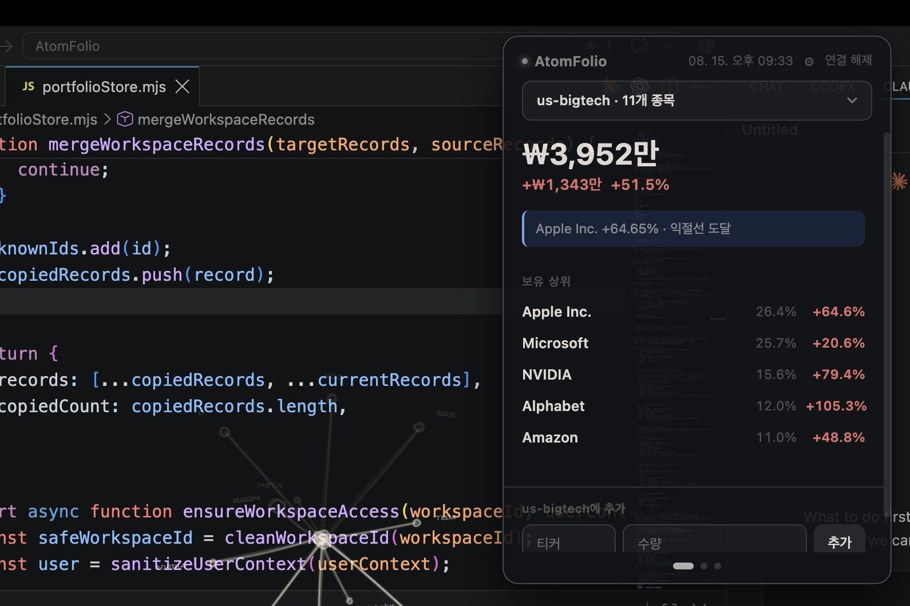

**Portfolio changes now reach the widget within ~5 seconds.** It used to wait for the next full
poll tick (60s default, up to 300s). A cheap version-check endpoint
(`GET /api/portfolio?version=1` — riding the existing `/api/portfolio` route via a query param
rather than a new path, since `api/portfolio/[id].js` already owns everything else under
`/api/portfolio/*`) now returns just `atomfolio_workspaces.updated_at`, already bumped on every
write in both store drivers. The desktop app polls it every 5 seconds (fixed, not
user-configurable) and only triggers the heavier full refresh when the value actually changes.
Real WebSocket/SSE push was ruled out — Vercel Hobby serverless functions can't hold a connection
open long enough to be worth it.

**Dragging the atom widget to a screen edge can now carry it to a different macOS Desktop
(Space).** We first built "Edge Dock" (push to an edge, collapse into a small tab), but that
wasn't actually what was wanted — the ask was macOS Mission Control's own built-in behavior:
holding a dragged window at the screen edge switches to the neighboring Space, carrying the
window along. Edge Dock was removed entirely, and the widget's drag mechanism itself changed —
it used to be a simulated drag (repeated `setPosition()` calls polling the cursor every 16ms),
which never registers as a real drag session to the window server, so Mission Control's
edge-switch behavior had no way to trigger for it. `.atom-visual-stage` now gets a *static*
`-webkit-app-region: drag` (present from first paint, never toggled by a class — a reactively
toggled version was tried and doesn't arm in time), with `.node-hit`/`.center-hit` carved back
out to `no-drag` so clicking an actual node/center still rotates/selects. No modifier key is
needed for the drag any more — grab the empty background and go. **Important caveat**: whether
this actually triggers a Space switch needs a real held mouse-drag gesture to test, which this
session had no way to automate — please try it yourself with multiple Desktops set up and report
back.

**Right-clicking the atom widget with a stock selected now links straight to that stock's news.**
"Open News" becomes "View {stock} News", opening the popover on the news page with that stock's
name already running through the search bar.

Docs were also corrected — both READMEs (`README.md`, `desktop/README.md`) described the tray
icon as atom-shaped, which was wrong (it's a small profit/loss dot; the atom is the separate
floating widget). The screenshot above was captured with macOS `screencapture` from the actually
running app; a first full-screen capture briefly surfaced an unrelated personal browser tab and
was discarded rather than used — the kept crop shows only this project's own VS Code window and
the AtomFolio popover/widget.

**Verified**: `npm run lint`/`npm test` (115 tests) all pass, web/desktop builds clean, the
packaged desktop app was rebuilt and relaunched with stdout attached — no new errors. The
Space-switch behavior itself remains unverified, as noted above.

## 2026-08-15 — Real Neon/Clerk connection, desktop account login, settings panel overhaul

Followed through on the previous day's readiness check for real. Provisioned Neon Postgres and
Clerk directly through the Vercel Marketplace (both on free plans) and wired
`DATABASE_URL`/`CLERK_SECRET_KEY`/`VITE_CLERK_PUBLISHABLE_KEY`/`ATOMFOLIO_BROKER_ENCRYPTION_KEY`
into production — confirmed live that `readiness.level` dropped from `blocked` to `warning` (only
the expected in-memory-rate-limit warning left), and that real workspace data is actually being
written to and read from Postgres.

Found and fixed two bugs along the way while using it for real (see
[`AtomFolio_Bugs.en.md`](AtomFolio_Bugs.en.md) for symptoms/root causes): workspace status staying
stuck on "guest" after a reload even while signed in (a missing session re-check in
`AuthPanel.jsx`), and the desktop menu bar app failing to connect when given a signed-in account's
workspace ID — it turned out the desktop app only ever sent a workspace ID header with no way to
send an auth token at all (it was a guest-only client by design). Fixed for real this time with a
new `server/deviceTokens.mjs`: generate a "desktop connection code" from the web settings panel
(`atomfolio_dt_...`), and the desktop app sends it as a Bearer token to connect to the actual
signed-in account. Only a SHA-256 hash of the code is ever stored, generating a new one instantly
revokes the previous one, and "disconnect all desktop devices" in the web settings kills all of
them at once.

Rebuilt the settings panel with an actual information hierarchy — language/base currency/date
basis/auto-save/daily snapshots used to all sit at the same flat level; now they're grouped into
Display / Storage & Sync / Account & Workspace, and each setting is a label + segmented-control row
on one line (kept the existing dark tone, hairlines, and cream-colored selection highlight —
did not turn this into a white card UI). The desktop connection code generate/regenerate/revoke-all
UI now lives naturally inside that account section.

## 2026-08-14 — Login/workspace security and production-readiness audit

Extended `GET /api/health` with a `readiness` field (new `server/productionReadiness.mjs`) that
reports whether Postgres/Clerk/the encryption key are actually configured in production, and
whether rate limiting is durable — so "is this deployment actually safe to run as a real
service" is answerable from the health endpoint instead of digging through console logs. Running
this check for real surfaced that production (`atomfolio.vercel.app`) currently has no
`DATABASE_URL` wired up, so the portfolio store is running on the `memory` driver — data can be
lost on any cold start or redeploy. Wrote that up as the top item in the new
[`docs/production-readiness.md`](production-readiness.md) pre-deploy checklist.

Hardened the guest-workspace access policy in production — a guest id is still an unsigned
credential (that residual limitation is documented, not solved, in this pass), but
`server/portfolioStore.mjs`'s `ensureWorkspaceAccess` now rejects (1) any `guest:<id>` whose id
isn't a real `crypto.randomUUID()` shape and (2) the shared `anonymous` bucket that unauthenticated
requests fall back to when no workspace id is sent at all — both only in production. Guest
workspaces created normally by the app (real UUIDs) are unaffected; only short/guessable dev-only
ids get blocked in production.

Restructured rate limiting (`server/rateLimit.mjs`) into a driver architecture — the existing
in-memory behavior stays the default, and setting `ATOMFOLIO_RATE_LIMIT_DRIVER=redis` plus a
connection string gives a real extension point for plugging in an actual Redis client (this repo
still doesn't add an external dependency itself — with no connection configured it logs a warning
and keeps running on the in-memory behavior).

Added a Clerk-headless password reset flow (email code → new password), an email display when
signed in, and an account/data-deletion request entry point (a mailto link pre-filled with the
workspace id when a contact address is configured, otherwise a clearly disabled state) to
`src/components/auth/AuthPanel.jsx`. Added an always-visible sign-in status chip (guest/signed-in)
in the top-right corner, just under the ⌘K hint — previously that state was only visible by
opening the settings panel.

Added tests: production rejecting unauthenticated custom workspaces, UUID-shaped guest ids being
accepted while non-UUID ones are rejected, `anonymous` being rejected in production
(`tests/workspace-access.test.mjs`), a new `tests/production-readiness.test.mjs`, and rate-limit
driver coverage in `tests/rate-limit.test.mjs`. `npm test` (109 tests), `npm run lint`, and
`npm run build` all pass.

## 2026-08-14 — Redesigned the currency model: purchase currency vs. quote currency

Follow-up to the entry right below (the "buy-price currency badge" fix). The user reproduced it
directly: adding QQQM at a buy price of 370,000, 6 shares, with the toggle on USD, showed a correct
₩2,553,365 market value but a nonsensical -₩3,131,864,635 profit. Reproduced it myself and found the
real gap — the previous fix only worked if the user actively switched the toggle. Its default is the
security's own trading currency (USD), so leaving it untouched and typing 370,000 anyway stored that
number as "370,000 USD", reproduced the original -99% bug against the real ~$300 quote, and then got
multiplied by the exchange rate on the profit side into the billions.

### What changed at the root

**Treated "the currency the user actually paid in" as a field completely separate from "the
currency the security trades in."**

- `resolvePosition` (`src/lib/portfolioAnalyticsSummary.js`) now tracks each holding's
  `purchaseCurrency` (what currency the buy price was actually entered in) independently of its
  `nativeCurrency` (what currency the security is quoted in). The buy amount converts from
  `purchaseCurrency`; the market value always converts from `nativeCurrency`; both get compared in
  the same base currency (KRW). When the two currencies match (the common case), return% is
  computed directly in that currency, completely unaffected by exchange-rate movement; when they
  differ (e.g. a real 원 cost basis for a USD-quoted stock), it's computed from the KRW amounts
  instead, correctly capturing the real return including FX movement. **Return% is now computed
  from actual amounts first, not trusted from a stored input.**
- **The buy-price field no longer pre-converts what's typed at all** — it stores the raw number
  exactly as entered, alongside the toggle's chosen currency as its own explicit `purchaseCurrency`
  field, instead of silently forcing it into USD the way the previous version did.
- **Switching the currency toggle now converts whatever's already typed** (e.g. an auto-filled
  "301.77" USD price becomes "425,581" when switched to 원) — previously the digits stayed the
  same and only the label changed, which was its own separate bug (an auto-filled USD price
  misread as 원 produced a +140,000% return once discovered).
- Fixed the holding-detail card's own buy-price display, which was still converting using the
  security's quote currency instead of its actual purchase currency.
- Holdings list rows and the detail card now show a secondary native-currency profit figure
  alongside the primary KRW one, for the case where that number is actually well-defined.

### Verified

Added the user's exact three verification formulas (foreign/원-purchase, foreign/USD-purchase,
domestic) as permanent automated tests — e.g. QQQM at 370,000원, 6 shares, a 1,410 exchange rate
→ market value ≈₩1,809,171, buy amount ₩2,220,000, profit ≈-₩410,829, return ≈-18.5% (plus the
opposite-sign case). Reproduced the reported scenario locally and confirmed the fix directly: QQQM
at 370,000원, 6 shares now shows market value ₩2,551,621 ($1,808.16), profit +₩331,621, return
+14.9%. `npm run build`, `npx eslint .`, `node --test` (96 tests, 95 pass + 1 pre-existing skip)
all clean.

## 2026-08-14 — Fixed foreign-holding currency math; cleaned up the portfolio screen

Chasing down "foreign stock buy price/valuation math looks wrong," the real cause wasn't where the
exchange rate was applied — it was that **no exchange rate was being applied at all**. A foreign
holding's buy price/current price come back in USD, but
`src/lib/portfolioAnalyticsSummary.js` summed each portfolio's totals (total market value, total
buy amount, total profit) without ever checking currency — a $1,600 position was added to a
₩700,000 position as if both were the same unit. This was subtle enough that the existing test
fixture (an SCHD holding: buyAmount '1600', marketValue '1560', no currency field) had the buggy
behavior baked into its "expected" snapshot without anyone noticing.

### What changed

- **New `src/utils/currency.js`** — the single standard for USD/KRW handling. Resolves a holding's
  currency in priority order: (1) confirmed by a live quote, (2) inferred from ticker shape
  (letters-only -> USD, 5–6 digit domestic code -> KRW), (3) defaults to KRW.
- **`resolvePosition` (the portfolio-totals math) now resolves each holding's currency and converts
  it to the base currency before summing.** The original (USD) native amount is kept alongside the
  converted one, so a foreign holding can show the KRW-converted amount as primary and the USD
  amount as secondary detail.
- **Added a USD/원 currency badge to the buy-price input** — it previously gave zero indication of
  which currency to type in.
- **The holdings list and the holding-detail card now show market value/profit/return %, in
  color** (previously showed nothing beyond return % — just a "-") — profit red, loss blue, the
  site's existing convention.
- **Removed the Explore/Manage view-mode toggle and the spreadsheet management table** — a
  redundant second way to view/edit holdings now that the list itself shows value and P/L inline.
  Editing a holding now has exactly one path: the 수정 (Edit) button.
- **Removed the standalone "Stock Lookup" toolbar entry** — ⌘K's command palette already searches
  by ticker/name and can add a holding directly, so search is now consolidated to that one entry
  point (its existing always-visible "⌘K" badge hint stayed as-is).
- **The workspace ID in Settings is now click-to-copy** — immediate "Copied"/"Copy failed" feedback
  with an icon change. Tries `navigator.clipboard` first, races it against an 800ms timeout, and
  falls back to `execCommand('copy')` — added after directly discovering that `writeText` can hang
  indefinitely with no response when clipboard permission is blocked in an automated test browser.

Verified: `npm run build`, `npx eslint .` (whole repo), `node --test` (92 tests, 91 pass + 1
pre-existing skip) all clean. Manually exercised in a local `npm run dev` session against a real
test portfolio mixing Korean ETFs, individual domestic stocks, and individual US stocks — totals no
longer add raw USD numbers into a KRW sum.

## 2026-08-14 — The atom widget stays on the Space it was opened on; the popover opens anywhere

Reverted the menu bar widget's "follows you across every Desktop (Space)/fullscreen app" behavior,
per direct feedback. The August 10 entry's fix for "the widget disappears during Spaces/fullscreen
transitions" (`setVisibleOnAllWorkspaces(true, { visibleOnFullScreen: true })`) ended up making the
widget chase the user across every Space — which, used in practice, turned out not to be the
wanted behavior.

- **Atom widget**: now only shows on whichever Space it was on when "Show atom widget" was turned
  on, and no longer follows you to a different desktop or into a fullscreen app. Removed the
  `atomWidget.setVisibleOnAllWorkspaces(...)` call, reverting to Electron's default (a window only
  renders on the Space it was created on).
- **Popover** (the tray-click panel): the opposite direction — since the tray icon itself is
  reachable from any Space, the popover now needs to **open correctly no matter which
  desktop/fullscreen app it's opened from**. Added
  `popover.setVisibleOnAllWorkspaces(true, { visibleOnFullScreen: true })`. The existing
  `positionPopoverNearTray` logic (which already repositions the panel against the tray icon's
  current location on every open) needed no further changes to make this work.

Verified: `node --check desktop/src/main.js` passes, lint clean, all 78 `node --test` tests pass.

## 2026-08-13 — Menu bar widget interaction polish (drag, click-through, category, sleep)

Done right after the baseline entry below, in the same stretch of work. These came out of actually
running the macOS menu bar widget and fixing what broke or was asked for — written up strictly
from the real commits, nothing invented.

### What changed

- **Idle rotation speed**: `AUTO_ROTATE_SPEED` 0.018 → 0.022 (~22%). Desktop widget only — the
  website has its own separate copy of this constant and is unaffected.
- **⌘-drag no longer sticks**: the root cause was the renderer never receiving pointer events once
  the cursor outran its own window. Replaced with the main process polling
  `screen.getCursorScreenPoint()` every 16ms while a drag is in flight, so the window tracks the
  cursor anywhere, including off-window and across displays. Releasing ⌘ mid-drag still stops it
  immediately, per the prior fix.
- **The widget now re-centers every time it's shown**: instead of restoring wherever a previous
  drag left it, showing the widget always repositions it to the primary display's center. This
  only worked when toggled off/on from the tray menu at first — a **separate bug** meant it didn't
  apply on a fresh app launch (`createAtomWidget` was bypassing `setAtomWidgetVisible`), fixed
  once found.
- **The info box overlapping the atom on click**: first patched with a semi-opaque backing plate,
  then redone properly after "remove the black box, still don't overlap" feedback —
  `.atom-visual-stage` now permanently reserves 52px of bottom padding, so the atom itself draws
  slightly smaller/higher and the info box has genuinely empty space to sit in.
- **Click-through for empty space around the widget**: the widget is a transparent window that
  never called `setIgnoreMouseEvents`, so clicking the empty margin around the atom ate the click
  instead of passing it to whatever app was behind. Fixed with a `document.elementFromPoint`
  hit-test — clicks pass through unless the cursor is actually over a node, the center, or the
  stage background while ⌘ (window-move) is held.
- **Category filter** (Settings → app settings): pick assetClass/region/sector/style/risk, and
  clicking a holding now **connects it with a solid line** to every other holding sharing that
  value (started out dashed, changed to solid per feedback). Same-category holdings stay at full
  opacity alongside the selected one instead of dimming with everything else.
- **Sleep mode**: makes the widget fully inert — it keeps floating and rotating, just stops
  reacting to the cursor at all, like a static desktop image. Started out as a settings-panel
  toggle, then moved to the tray icon's own right-click menu (next to "Show atom widget") per
  feedback that it didn't belong in Settings.

Verified: `npm run build:renderer && npm run build:main-libs` passes, lint clean, the web app's own
`npm run build`/`node --test` (78 tests) unaffected. Live interactive verification (actually
dragging fast, confirming click-through passes through, etc.) wasn't fully completed this round
due to environment constraints — noted honestly in the commit messages too. Flag it if anything
looks off in real use.

### Screenshots

The screenshots for this entry are being **captured and added by the user directly** — automated
capture kept picking up unrelated windows on a busy desktop, so this round wasn't automated. Drop
the files below into `docs/updates/assets/` and they'll render here automatically.

| File | Shows |
| --- | --- |
| `assets/atomfolio-tray-menu-2026-08-13.jpg` | Tray icon right-click menu (Show atom widget / Sleep checkboxes) |
| `assets/atomfolio-widget-dark-2026-08-13.jpg` | Atom widget, dark theme |
| `assets/atomfolio-widget-light-2026-08-13.jpg` | Atom widget, light theme (confirming the black atom is actually visible) |
| `assets/atomfolio-popover-news-2026-08-13.jpg` | Popover — news page |
| `assets/atomfolio-popover-settings-2026-08-13.jpg` | Popover — settings page (includes the category filter; sleep is no longer here) |

<!--
Uncomment once the files above exist:

-->

---

## 2026-08-12 — Light/dark theme tried and rolled back, KIS quote provider, disappearing-holding bug

- **Added the KIS (Korea Investment & Securities) domestic quote provider**, routed ahead of the
  existing fallback chain (`825bc94`).
- **Added a manual light/dark theme setting** (`3281515`), then spent several commits fixing the
  atom being nearly invisible in light mode — halo/alpha-blending asymmetry (`8281107`), boosting
  JS-driven SVG opacity too (`2ea03b6`), hard-coding the main line/node/label color to pure black
  (`55e30c0`), dropping the group blur filter and depth-jitter (`38303e7`), thickening strokes/
  nodes and bolding labels (`e8b2a6d`).
- Ultimately **removed the light/dark toggle entirely and reverted to dark-only** (`46b02a8`) — not
  a failure so much as a conclusion the experiment confirmed: a dark background is intrinsically a
  better fit for what the atom visualization is trying to be.
- Removed the AI summary feature, fixed theme/tooltip bugs, added a desktop atom overlay, redesigned
  the drawer (`6a528c4`).
- Migrated remaining warm-cream color leftovers, removed dead `.spiral-glyph` CSS (`90906ef`).
- **Bugs**: holdings matching certain name patterns silently vanishing from the atom scene, fixed
  (`ccc3ce6`); a stray `.manual.csv` suffix being appended to manually-created portfolio names,
  removed (`cd6e562`).

## 2026-08-11 — Command palette + management table, web light/dark

- **Command palette (⌘K)** and a **management-tab table view** added, plus desktop error-state
  polish (`70af14b`).
- Excluded the active portfolio from its own preview-atom orbit (`53b7c58`).
- Unified portfolio-switch transitions, tool-drawer docking, perf and dead-code cleanup (`473a9a0`).
- Removed a dead `pendingPortfolioSwitch` flag that was blocking CI lint (`e276f4f`).

## 2026-08-10 — Atom dark-mode contrast, Spaces/fullscreen bug

- Improved atom dark-mode contrast, a custom portfolio dropdown, settings redesign, transition
  rotation (`397f2a2`).
- **Bugs**: the menu bar atom widget disappearing during macOS Spaces/fullscreen transitions,
  fixed, alongside collapsing quick-add on the settings page (`bbb9bdd`) → later reverted the
  quick-add hiding while fixing "mere hover moves the widget" (`0030179`).

## 2026-08-09 — Atom dissolve/materialize transition, menu bar settings split

- Atom dissolve/materialize transition animation, settings split out, a broader menu bar design
  pass (`75b354b`).
- **Bugs**: widget re-open/⌘-center bugs fixed, settings groups reorganized, a padding audit,
  light/dark theme applied (`214ba4a`).

## 2026-08-08 — Menu bar gesture split, ⌘+drag bug

- Split rotate/move gestures, edge snap, a right-click context menu, keyboard shortcuts, quick add
  + news search (`a394a7a`).
- **Bug**: ⌘+drag not actually moving the window, fixed (`ab4da79`).

## 2026-08-07 — Menu bar widget opacity/resize controls

- Opacity controls, a resizable atom widget, swipe/drag polish (`986e730`).

## 2026-08-06 — Menu bar popover card-stack swipe

- Introduced swiping between atom/news/settings pages in the popover as a card stack (`2082ac3`).

## 2026-08-05 — The macOS menu bar companion app is born + news improvements

The day this project went from **web-only to web + desktop**.

- **Added the macOS menu bar companion app for the first time** (`50fb9ff`). The same day went on
  to reuse the real atom visual (`cdbfb1e`), real 3D trackball rotation (`a8700c7`), hand-drawn
  nodes on a black space background (`04dda15`), per-portfolio switching + star-chart atom
  (`3ed3dd6`), and favicon-based tray icons (`eaf44d9`) — several iterations in a single day.
- **Bugs**: the packaged menu bar app crashing silently with no window ever appearing, fixed
  (`03e6c77`) → build target narrowed to arm64-only (`41d471f`); `PortfolioAllocationCard` dropping
  its `className` prop, fixed (`ce71c43`); the date-basis setting not applying to heatmap/news
  timestamps, fixed (`56a1873`).
- Added news thumbnails + a Finnhub foreign-news provider + response caching (`7c8b4cb`),
  consolidated sidebar tools/shrunk detail cards/wired up news polling UI (`7d9b8f9`), news
  pagination (20/page) + faster default view + cross-page dedup (`4039c46`), news panel state
  persisted across tab switches (`429a5b0`), numbered pagination + live-quote perf improvements
  (`6a020a1`).

## 2026-08-04 — Redesigning the portfolio-switch transition (black hole → spaceship fly-to)

- Stage D 1–3: built the black-hole-absorption transition as a state machine with a spring damper
  (`2867bf2`, `f3105b0`, `310ab43`), then **redesigned it as a "spaceship flying to the next
  portfolio" effect** for clearer directionality (`4f46c75`).
- Retargeted this fly-to transition to portfolio switching, made atoms read more clearly as 3D
  (`19f4e42`).
- **Bug**: a boxy artifact in the atom/nucleus 3D shading, fixed, sphere shading smoothed
  (`d98bc74`).
- Simplified node shape: five tilted rings became a single wobbled icosphere gem (`77cb63b`).

## 2026-08-03 — Starting the WebGL 3D rewrite + a new auth/security layer

The day this project started moving from a **static SVG sketch to a Three.js WebGL 3D scene**, and
the day login stopped being nonexistent.

- **Auth/workspaces**: Clerk bearer tokens verified server-side, header trust hard-disabled on
  Vercel (`5d958f7`); a custom Clerk sign-in/sign-up UI wired into workspace-claiming
  (`8be0d97`); shared API handlers + workspace access control (`a566475`, continuing from
  7/11).
- **WebGL rewrite**: consolidated App.jsx's duplicate atom-scene math into `scene.js`
  (`e6ed12a`); Stage A (static rendering behind a dev toggle, `cdc0a3a`); Stage B (raycaster
  interaction + CSS2D labels, `435d0ad`); Stage C (always-on bloom + `AtomDetailPanel`, no
  transition animation yet, `d9ddfec`).
- **Cleanup**: Phase 0 removed dead code — 9 orphaned files plus roughly 4,800 lines from
  App.jsx (`28f3809`).
- Added ESLint flat config + Prettier, fixed lint-flagged bugs (`a0e7cea`); added a CI workflow
  for lint/test/build (`1ea4994`); serialized local portfolio-store writes to stop concurrent
  writes losing data (`bd7ea3f`); added CSV structure-inference + analytics-summary + store
  contract tests (`b14ca7c`); extracted hardcoded security-knowledge data into JSON (`09d33ec`).
- **Bug**: missing `font-family` on the AI summary's risk/data-quality list items, fixed
  (`8406bc9`).

## 2026-07-11 — Financials provider, rate limiting/caching (resumed after ~2 months quiet)

No commits for roughly 7 weeks after May 23; work picked back up this day.

- Added company financials providers, extended market-data libraries (`2344d33`).
- Improved CSV structure inference for portfolio ingestion (`2cfd2c8`).
- Introduced shared API handlers + workspace access control (`a566475`) — the foundation for
  8/3's Clerk auth work.
- Added AI summary, financials, and workspace session UI (`354e81d`).
- Added portfolio-core and workspace-access tests (`d0749d4`).
- **Per-IP rate limiting + a market-quote cache with stale fallback** (`b07312b`) — the starting
  point of today's API-abuse protection.
- Added light/dark favicons (`7f46c16`), removed unused `@react-three` dependencies (`887ec50`).

## 2026-05-23 — Doc cleanup, a CSV ticker-parsing bug

- Updated AtomFolio docs/persistence, pointed docs at the deployed site URL, unified docs on the
  canonical domain and removed mobile-only docs (`75083bb`, `6f04c4c`, `0fc84f5`, `5af4052`).
- Resized the README's concept sketch (`d41073d`, `3f0795a`).
- **Bug**: ticker parsing for imported portfolios, fixed (`a2d40a8`).
- Polished portfolio display controls (`30dfe59`).

## 2026-05-20 — Live quotes go in, deployment/domain cleanup

- **Started using Naver Securities live quotes as the first-choice source** (`e2280c9`) — the
  starting point of today's quote-routing chain.
- Normalized uploaded holdings against live quotes (`f4c1610`).
- Added AtomFolio service APIs + live news (`0d83bb5`).
- Added a deployment link + favicon, cleaned up domain/favicon, redesigned then simplified an
  adaptive atom favicon (`b412476`, `2bba415`, `80987b9`, `cf6d2bb`).
- Broad app/README refresh, reduced the default tool-panel width (`3d00b62`, `c52bb11`).

## 2026-05-08 — Tool dock interactions, atom scene keeps rotating on hover

- **Bug**: floating tool dock interactions, fixed (`897279d`).
- Custom allocation dock placement now respected (`d875f52`).
- Kept the atom scene rotating even while hovered (`e4a0bc6`).

## 2026-05-07 — Added a README architecture diagram

- Added and refined the README's first system architecture diagram (`a2838e5`, `02918d9`).

## 2026-05-05 — Expanded README feature documentation

- Expanded the README's feature documentation (`8c27173`) and polished it over several commits.

## 2026-05-04 — Documented the build process

- Documented the AtomFolio build process (`f700f43`), cleaned up the README, removed a "future
  improvement ideas" section (`1b03803`).

## 2026-04-29 — Portfolio upload improvements, first docs

- Improved portfolio upload and stock metadata handling (`94fd219`).
- First documentation of AtomFolio's deliverables (`9b58c0f`).

## 2026-04-27 — The very first commit

- `Add AtomFolio dashboard project` (`3775969`) — the real starting point of this project. At this
  point the atom scene was a 2D SVG sketch that started from a hand-drawn concept (see the
  screenshot comparison in "Cumulative highlights" below).

---

## Cumulative highlights — revisited by theme (2026-04-27 – 2026-08-13)

> If the dated list above shows *when* each commit happened, this section groups the same span of
> work **by theme** instead — quote reliability, auth, the menu bar app's introduction, the
> light/dark experiment, screenshot comparisons, and architecture diagrams all read better as one
> continuous story than as scattered commits. For a commit-by-commit trail, see the dated entries
> above; for what actually changed and why, read on.

### The short version

| Area | Earliest commits | Current |
| --- | --- | --- |
| Auth | None — localStorage only | Clerk email/password login + guest-workspace promotion |
| Storage | localStorage only | localStorage + Postgres (Neon) / JSON-file fallback, isolated per workspace |
| Quote sources | Yahoo → Stooq, two-step fallback | KIS (official) → Naver/Mirae (raced concurrently) → Yahoo → Stooq, with a circuit breaker, per-provider failure tracking, and outage alerting |
| Atom visualization | Static SVG sketch lines | WebGL (Three.js) 3D scene, redesigned several times (node shape, bloom, transitions) |
| Navigation | Fixed sidebar icons | Command palette (⌘K) searching across every portfolio at once, a separate management table view |
| Platforms | Web only | Web + a macOS menu bar companion app (Electron) |
| Market news | Naver/Bing RSS only | + Finnhub (optional), pagination, caching, thumbnails |
| Observability | None | `/api/health` now reports per-provider failure counts, rate limits, cache state, and outage alerts |
| Tests | Almost none | 78 (`node --test`) — auth isolation, rate limiting, KIS routing, workspace-store contracts, etc. |

The sections below go into what each of these actually changed, concretely.

### Atom visualization & navigation

**At first**, this was a 2D SVG sketch that started from a hand-drawn concept — thin lines
radiating from a center, small circles at their ends, handwriting-style labels. The "then"
screenshot below (`docs/assets/atomfolio-dashboard.png`, from the earliest commits) shows exactly
that.

**Now**, it's a Three.js WebGL 3D scene, and the commit history shows this is where the most
iteration went:

- **A staged rewrite (Stage A→D)**: static rendering (A) → raycaster interaction + CSS2D labels
  (B) → always-on bloom + a detail panel (C) → a full-scene transition on portfolio switches (D).
  The first version of that transition was a "black hole absorbing the scene" effect; it was later
  redone as a "spaceship flying to the next portfolio" effect, which reads far more directionally
  clear.
- **Simplified node shape**: five tilted rings became a single wobbled icosphere gem — removing
  boxy shading artifacts and smoothing out the sphere shading along the way.
- **Command palette (⌘K)**: searching by name or ticker now returns matches **across every
  portfolio at once** (see the screenshot below) — originally, search only worked inside whichever
  portfolio was currently active.
- **A dedicated management table**: separate from the 3D scene, a plain table lets you edit name,
  ticker, cost basis, quantity, return, and asset class directly — bulk edits are far faster here
  than manipulating the 3D scene.
- **New-user onboarding**: an empty-state CTA and a ⌘K discoverability hint were added so a
  first-time visitor with no portfolio yet isn't just staring at an empty scene with no idea what
  to click.

### Auth & workspaces (an entirely new layer)

The original version had no concept of login at all — browser localStorage was the whole story,
and switching devices meant losing everything. Now:

- **Clerk**-backed email/password login exists (a custom UI drawn directly against Clerk's
  headless `useSignIn`/`useSignUp` hooks),
- you can still use the app instantly before logging in, under a `guest:<uuid>` workspace, and
  logging in migrates that guest data into the logged-in account's workspace
  (`/api/workspace/claim-guest`),
- the server verifies Clerk JWTs via `@clerk/backend`'s `verifyToken`, and there's a test proving
  one authenticated user genuinely cannot reach another owner's workspace
  (`a different authenticated user cannot access another owner workspace`),
- and storage itself went from localStorage-only to **Postgres (Neon), with a JSON-file fallback**.

### Live market-data reliability

This is where the session that wrote this entry concentrated. Starting from "how do we improve
quote data coverage and stability," five changes were actually implemented — **without spending
any money** (`src/lib/liveMarketData.js`, `server/marketData/liveQuoteRouter.mjs`,
`server/marketDataCache.mjs`, `server/alerting.mjs`).

| Problem | Before | Now |
| --- | --- | --- |
| Every request waited out a dead provider | If Naver was down, every single request paid its full timeout, every time | A provider that fails 3 times in a row is skipped for 30 seconds (circuit breaker) |
| Naver/Mirae tried one after another | Mirae was only tried **after** waiting for Naver to fail | Two independent sources are raced concurrently; whichever answers first wins (`raceQuoteAttempts`) |
| Provider failures were invisible | Only logged once, and only if every provider failed at once | Every provider failure is now recorded and shows up at `/api/health?details=events` as `provider-fail:naver`, etc. |
| Nobody knew about a total outage | Stale responses went out silently, no alert | `server/alerting.mjs` detects and records total outages, and can optionally push to a Slack webhook (`ATOMFOLIO_ALERT_WEBHOOK_URL`, free) |
| A name-only domestic lookup could never reach KIS | KIS was only tried when a ticker was present | A Korean name is now resolved to a KRX code via the offline local alias table first, so name-only lookups get a shot at KIS too |

All five changes make smarter use of **existing free/official sources** — none required a new paid
API contract. The test suite grew to 78 tests (including one new test), and the build and linter
both pass. The behavior is also documented in the README's "API abuse protection" section.

### CSV ingestion robustness

CSV auto-inference was always a core feature, but feeding it more real-world data surfaced (and
fixed) a handful of concrete bugs:

- **Holdings silently disappearing from the atom scene** due to a name-pattern re-check — fixed
  (`Fix stocks silently dropped from atom scene by name-pattern re-check`).
- **A stray `.manual.csv` suffix** being appended to manually-created portfolio names, even though
  the user had typed their own name — removed.
- **The date-basis setting not applying** to the heatmap and news timestamps — fixed.
- **`PortfolioAllocationCard` dropping its `className` prop**, which broke the allocation donut's
  layout — fixed.

### Light/dark mode — tried, then rolled back

At one point, the app genuinely had three theme settings: system, light, and dark. Several commits
went into fixing light-mode issues — the atom being nearly invisible against a light background,
halo and alpha-blending asymmetry — but the end state rolled all of it back to **dark-only**
(`Remove light/dark theme toggle entirely — dark is the only mode again`). Not a failure so much
as a conclusion reached through the experiment: a dark background is intrinsically a better fit
for what this app's atom visualization is trying to be.

> Note: this is the **website's** light/dark story. The **menu bar widget** still has its own
> system/light/dark theme setting, independent of this decision — which is why the entry above
> this one has a screenshot confirming the light theme's black atom is actually visible.

### An entirely new platform — the macOS menu bar companion app

AtomFolio started as a web app only. It now also has a **separate Electron project** under
`desktop/` — a macOS menu bar app that reuses the existing API (`/api/portfolio`,
`/api/market/news`) as-is, without touching any web/server code.

#### What it does

- An atom-shaped tray icon sits in the menu bar; clicking it opens a small floating widget showing
  your top holdings by weight **orbiting the portfolio total at the center**. Drag to spin the
  orbit, or leave it alone and it slowly auto-rotates.
- Clicking a single holding shows its market value, P/L, and weight; clicking again (or clicking
  the center) returns to the total.
- The tray icon itself changes color with your overall P/L direction — profit (red, following
  Korean investor convention), loss (blue), or neutral (`trayDot-profit.png` /
  `trayDot-loss.png` / `trayDot-neutral.png`, with @2x Retina variants) — deliberately *not* named
  as a macOS "Template" image, since macOS force-monochromes those and this app's entire point
  here is the color.
- The popover holds a news search and a settings page, swipeable between as pager cards.
- Holding-related news is polled every 60 seconds and surfaced as desktop notifications (not true
  real-time; the poll interval is hard-floored at 60 seconds so a misconfigured client can't hammer
  the shared API).
- There's no full OAuth login yet — it reuses the web app's existing guest/workspaceId system.
  Pasting the Workspace ID shown in the web app's Settings → Workspace screen connects it.

#### What got fixed along the way

The menu bar app went through its own round of iteration — a widget that vanished across
Spaces/fullscreen transitions, ⌘+drag not actually moving the window, a packaged build that
crashed silently with no window ever appearing, rotate/move gestures fighting each other. Each got
its own fix commit (the next round of drag/click-through/category/sleep work is in the entry
above). The build target is now scoped to Apple Silicon (arm64) only, for release stability.

#### Being upfront about how these screenshots were taken

The menu bar app is a native macOS tray widget, so it couldn't initially be captured with browser
automation. It was actually launched locally (`cd desktop && npm run dev`) and captured with
macOS's built-in `screencapture` command instead — the three images below are not mockups, they're
**the real tray widget and popover, actually running on macOS**, connected to a real local test
workspace (`portfolio_test2`, 11 holdings) over `localhost:8787`, with a live Naver market-news
feed showing through.

One thing worth being fully transparent about: an early attempt at this captured the *entire*
screen and picked up unrelated windows from other apps (a chat app conversation, a notes app) that
had nothing to do with this task. **That file was deleted immediately, without being saved,
attached, or shown anywhere.** Every capture after that point first hid unrelated apps (chat,
notes, Finder) via macOS's `System Events`, captured only the screen area the user pointed to (a
Chrome/Google window), and immediately restored those apps' visibility afterward. The images below
are cropped from those clean captures only.

**The atom widget** — an always-on-top floating window with top holdings orbiting the portfolio
total. The real Chrome window behind it (the AtomFolio GitHub repo, a YouTube tab) shows it's
genuinely floating over the desktop, not a mockup:

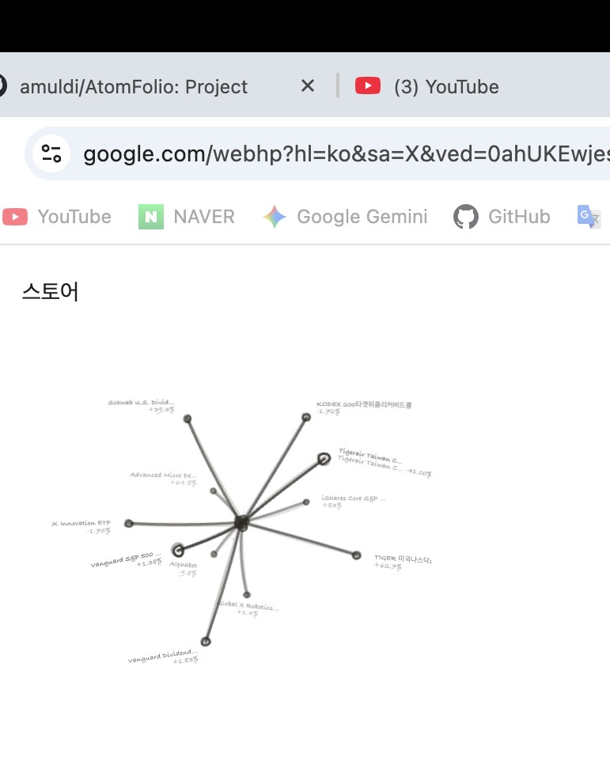

**The popover** (news / quick-add / settings pager) that opens from the tray icon — showing
`portfolio_test2 · 11 holdings` with a live Naver market-news feed:

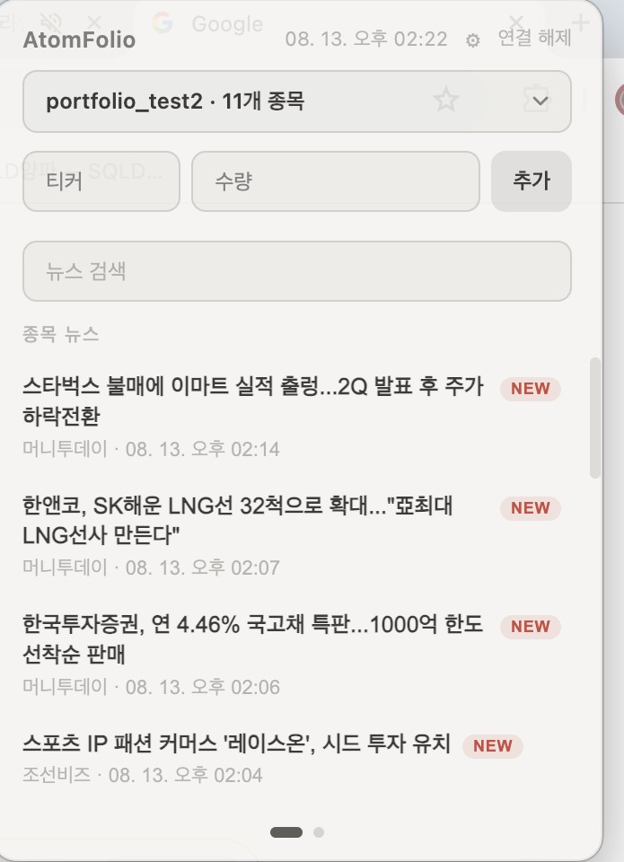

**Both windows together**, floating over the Chrome/Google window the user pointed the capture at:

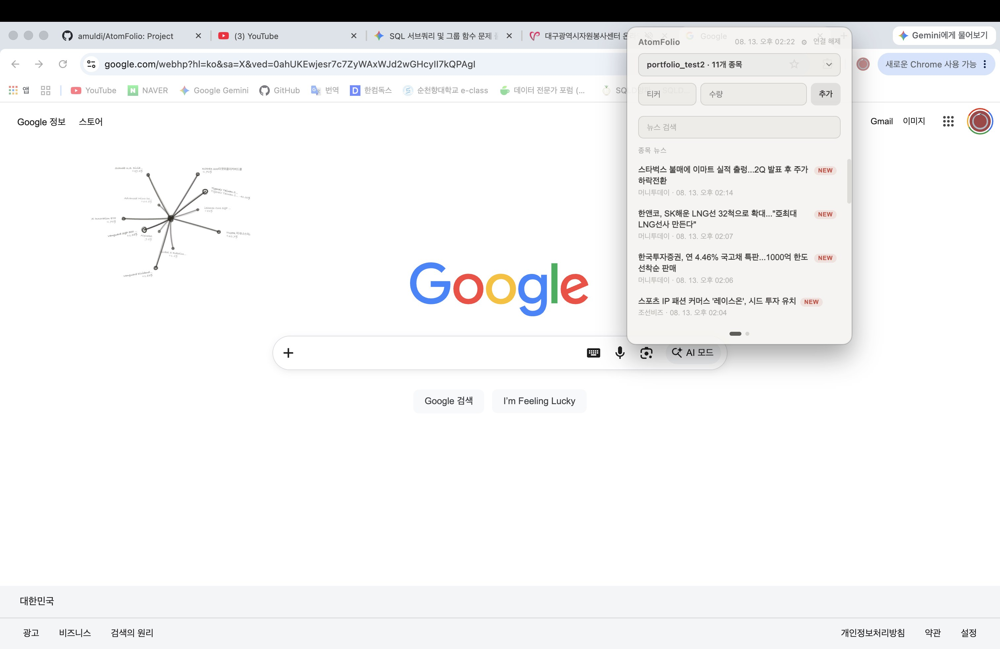

(Note: these three were captured before the info-box-overlapping-the-atom issue was fixed in the
entry above — see that entry's own screenshots for the current look.)

### Screenshots — compared to the initial version

#### The atom scene

**Earliest commits** (`docs/assets/atomfolio-dashboard.png`): thin sketch lines and small
circular nodes, with a fixed vertical rail of X/star/crown/hexagon/ring icons on the left.

**Current** (captured locally when this entry was written): the same "radiating from a center" concept
persists, but there's now an Explore/Manage tab pair and a command palette (⌘K) up top, and the
left icon rail has been reorganized into Portfolios / Search / Summary / Compare / Simulation /
News / Settings.

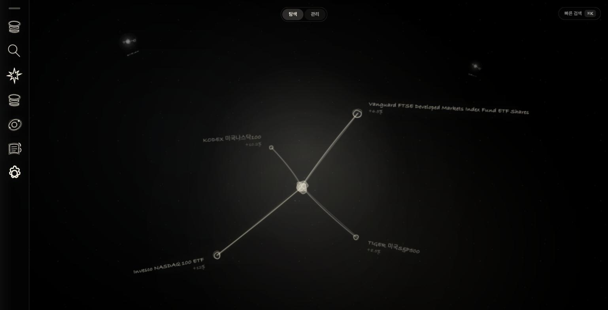

#### Summary tools (heatmap + portfolio score + allocation)

**Now**: category filters, service-analytics stats, a daily P/L heatmap, a 6-axis portfolio-score
radar, and an allocation donut all live in one panel.

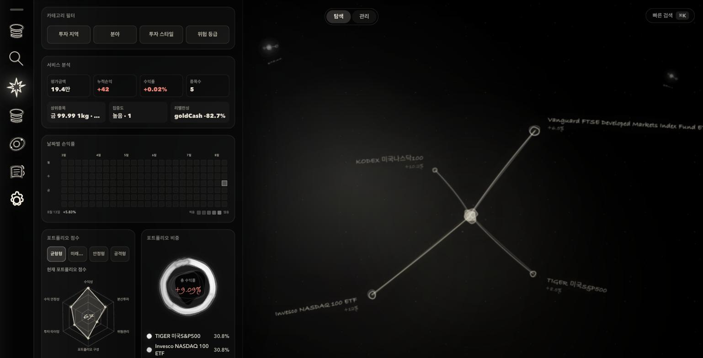

#### Investment simulation

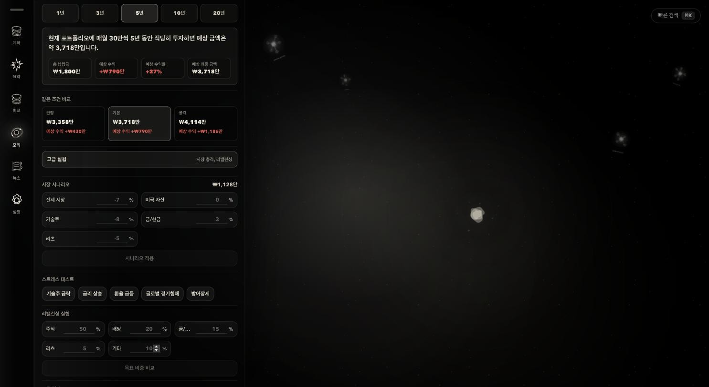

#### Market news (live Naver market-news feed, confirmed working)

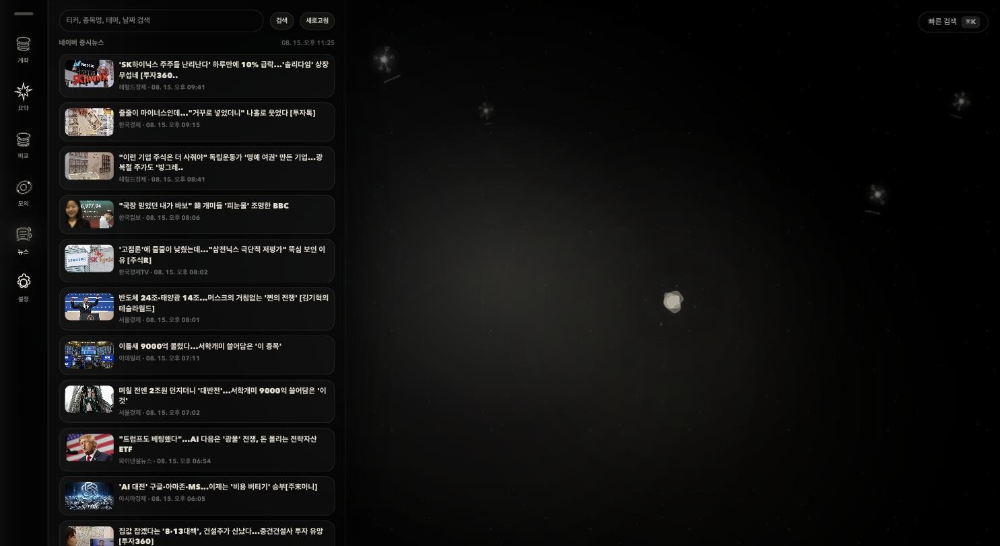

#### Command palette (⌘K) — searching across every portfolio

The same holding name shows which portfolio it belongs to (`테스트계좌.manual`,
`demo-portfolio`, etc.), so holdings scattered across multiple portfolios can be found in one
search.

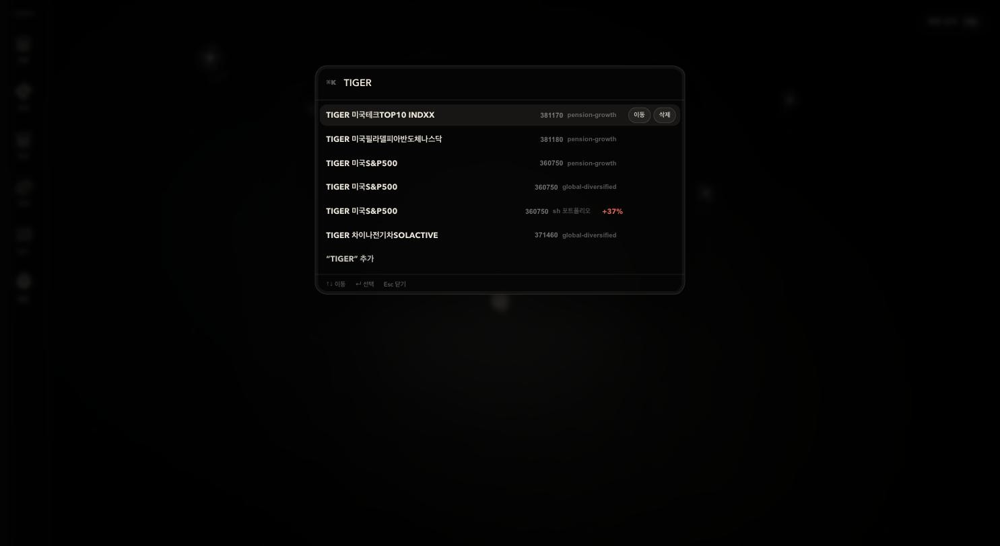

#### Settings

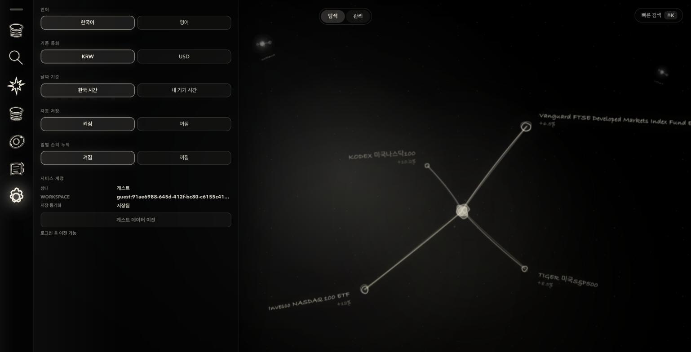

### Architecture — as of this entry

Redrawing the README's original architecture diagram with this entry's additions (circuit
breaker, provider racing, outage alerting, KIS name-based routing) and the new platform (the menu
bar app) layered in:

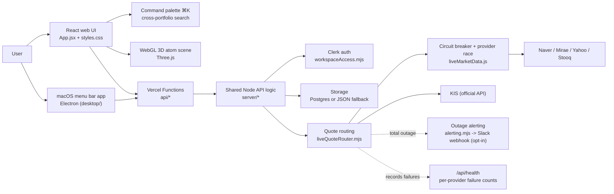

### Quote-lookup flow — the resilience layer added in this entry

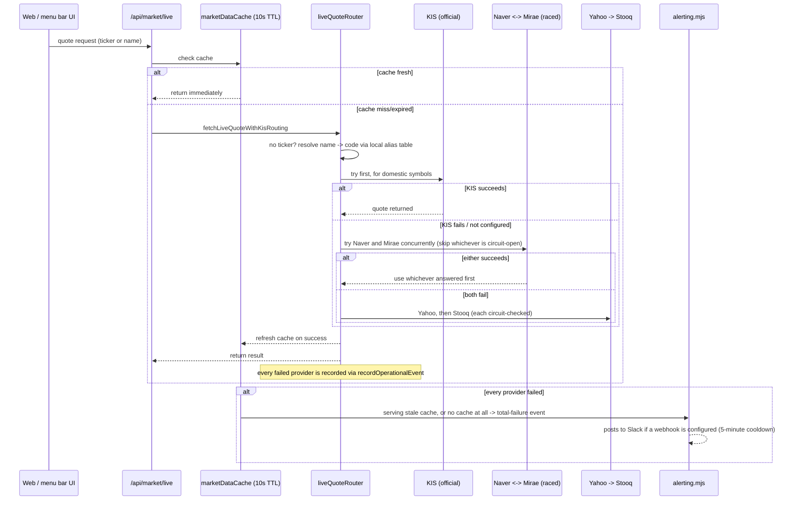

## See also

- For the app itself, see [`README.md`](../../README.md).
- For running the menu bar app, see [`desktop/README.md`](../../desktop/README.md).
- Bugs found along the way are tracked separately in [`AtomFolio_Bugs.en.md`](AtomFolio_Bugs.en.md).
- The Korean version of this document: [`AtomFolio_Updates.md`](AtomFolio_Updates.md)
