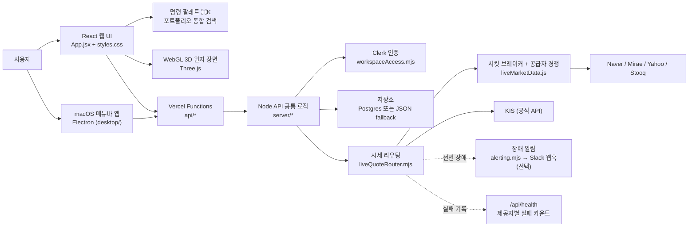
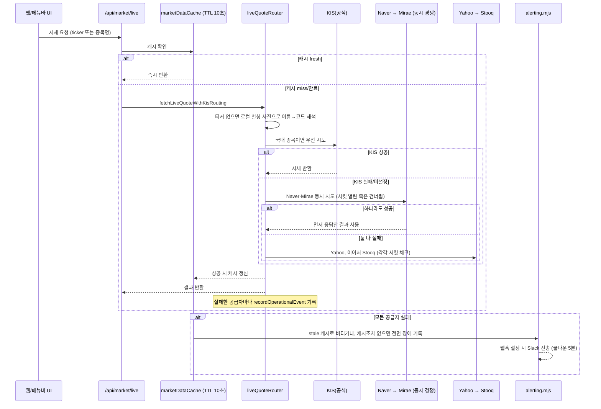

# AtomFolio 업데이트 로그

> 이 문서는 [`README.md`](../../README.md)를 대체하지 않습니다. README는 앱 자체(실행 방법, 기능,
> 아키텍처)를 설명하는 기준 문서로 그대로 두고, 이 문서는 **날짜별로 쌓이는 변경 기록**입니다.
> 최신 항목이 맨 위에 오고, 각 항목은 그 시점에 실제로 로컬에서 실행한 화면을 캡처해 붙입니다 —
> 합성하거나 상상해서 그린 스크린샷은 없습니다.
>
> 아래 날짜별 항목은 이 프로젝트의 **실제 첫 커밋(2026-04-27, `Add AtomFolio dashboard project`)부터**
> `git log` 기준으로 정리했습니다 — "오늘"을 시작점으로 잡지 않고, 진짜 시작부터 훑을 수 있게
> 했습니다. 4~5월/7월 초반 항목은 커밋 메시지 기준 요약이고, 8월 이후 항목(특히 8월 13~14일)은 그
> 당시 세션에서 직접 검증하며 쓴 상세 기록입니다. 발견된 버그/오류는 이 문서와 별도로
> [`AtomFolio_Bugs.md`](AtomFolio_Bugs.md)에 계속 정리합니다.

## 2026-08-15 — 원자 위젯 드래그를 다시 ⌘ 필수로 되돌리고, 멈춰버리는 버그와 뉴스 날짜 버그를 고침

바로 위 항목에서 원자 위젯 드래그를 "빈 배경을 그냥 잡고 끄는" 네이티브 OS 드래그로 바꾸고
Space 전환까지 노렸는데, 다시 써보니 원래 의도와 달랐습니다 — 위젯은 지금 떠 있는 Space 하나에
그대로 남아 있어야 하는 물건이지, 드래그 중에 사용자를 따라 다른 Desktop으로 넘어가야 하는
물건이 아니었습니다. 드래그 방식을 이전의 합성(IPC 폴링) 드래그로 되돌리고, ⌘(Command)를
누른 채로만 창이 움직이도록 다시 막았습니다.

**되돌리는 과정에서 진짜 버그 두 개를 발견해서 같이 고쳤습니다.**

1. **⌘을 안 눌러도 위젯이 그냥 잡히면 움직였습니다.** 네이티브 드래그 실험 중 지워졌던 ⌘ 체크가
   되돌리는 과정에서 복구되지 않고 빠져 있었습니다 — `handleWidgetDragStart`에
   `event.metaKey` 검사를 다시 추가했습니다.
2. **드래그가 끝나지 않고 계속 창을 따라다녔습니다.** 클릭-통과(click-through) 판정 로직이
   "지금 드래그 중인지"를 노드 회전 드래그(`dragRef`)만 보고 있었고, 위젯을 옮기는 드래그는
   전혀 반영하지 않았습니다. 드래그는 `.atom-section`의 바깥 여백(패딩)에서 시작하는데, 이
   여백은 `.atom-visual-stage`의 실제 영역 바깥이라 커서가 거기서 조금만 벗어나도 창이
   클릭-통과 상태로 넘어가 버렸고, 그 뒤로는 마우스 이벤트를 아예 못 받아 드래그를 끝낼
   `pointerup`조차 도착하지 못했습니다. `widgetDragActiveRef`를 추가해 위젯 드래그 상태를
   클릭-통과 판정에 반영하고, ⌘을 누르고 있는 동안은 `.atom-visual-stage` 위에 있는지와
   무관하게 무조건 상호작용 가능하도록 넓혔습니다.

고치면서 추가로 발견한 좁은 엣지 케이스도 정리했습니다 — 원래는 노드나 중심 원 위에서
⌘-드래그를 시작하면 그 프레스가 회전/선택 핸들러에 먼저 먹혀서 창이 안 움직였습니다.
`handleNodePointerDown`/`handleCenterPointerDown`(그리고 웹과 공유하는
`src/components/atom/index.jsx`의 `onCenterPointerDown` 콜백)이 ⌘이 눌려 있을 때는
`stopPropagation()`을 하지 않고 그대로 넘겨주도록 고쳐서, 이제 ⌘만 누르고 있으면 위젯 어디를
잡든 항상 창이 움직입니다.

**팝오버 요약 페이지에서 뉴스/설정 바로가기 버튼을 없앴습니다.** 요약 페이지는 포트폴리오
숫자만 보여주는 곳으로 좁히고, 뉴스/설정으로는 페이저 스와이프·점, 헤더의 ⚙ 버튼, 위젯
우클릭 메뉴로만 이동하도록 정리했습니다.

**뉴스 날짜가 실제보다 하루 늦게 표시되는 버그를 고쳤습니다.** 네이버 뉴스가 "2026.08.15.
23:45"처럼 시간대 표기 없이 KST로만 날짜를 주는데, `marketNews.js`의 `parsePublishedAt`이
이 문자열을 `Date.parse()`로 그냥 파싱하고 있었습니다 — 문제는 Vercel의 서버리스 Node
런타임이 기본적으로 UTC를 쓴다는 점이었습니다. 시간대 표기가 없는 문자열을 UTC 기준으로
해석하면 KST보다 9시간 늦게 읽히는데, 오후 3시 이후에 올라온 뉴스는 그 9시간을 더하면
다음 날 UTC 새벽으로 넘어가 버려서, 화면에 찍힌 날짜가 실제보다 하루 밀려 보였습니다.
`TZ=UTC node -e "..."`로 직접 재현해 확인한 뒤, 연/월/일/시/분을 직접 파싱해
`Date.UTC(...) - 9시간`으로 KST에 고정 앵커링하도록 고쳤습니다(한국은 서머타임이 없어서
고정 오프셋으로 안전합니다). 네이버 원문이 "2026.08.15. 23:45"(마침표+시간)와 "2026.08.15
23:45"(공백만) 두 가지 형태로 다 오는 것도 함께 확인해서 정규식을 넓혔습니다. RSS
`pubDate`처럼 이미 명시적 오프셋이 있는 날짜는 건드리지 않았습니다. `TZ=UTC`/`TZ=Asia/Seoul`
양쪽에서 통과하는 회귀 테스트(`tests/market-news-date.test.mjs`)를 새로 추가했습니다.

**포트폴리오 카드에서 계좌 정보/개수 줄을 없앴습니다.** 관리 탭의 포트폴리오 목록 카드가
포트폴리오명 아래에 "정보 없음" 또는 "N개 종목 · M개 행"을 함께 보여주고 있었는데, 사용자가
직접 물어본 뒤("정보 없음"은 계좌 메타데이터가 CSV에 아예 없을 때 표시되는 문구, "N개 행"은
동일 종목의 날짜별 반복 행 수를 뜻하는 것으로 확인) 둘 다 필요 없다고 판단해 포트폴리오명만
남기고 지웠습니다. `summarizePortfolioEntryAccounts()`가 계산하는 값 자체는 다른 화면(수동
입력 폴백)에서 여전히 쓰이기 때문에 그대로 두고, 이 카드 쪽 렌더링만 줄였습니다.

**검증**: `npm run lint`(웹+데스크톱) 클린, `npm test` 119개 중 118 통과·1 skip(기존과 동일)·0
실패, 데스크톱 렌더러/메인-libs 번들 재빌드 클린, 컴파일된 번들에 ⌘ 체크와
`widgetDragActiveRef`가 실제로 포함된 것 확인. 실제 마우스로 잡고 옮기는 제스처 자체는 이
샌드박스에서 시뮬레이션할 방법이 없어 라이브로 재현 검증하지는 못했습니다 — 코드 리딩과
자동 테스트로만 확인했습니다.

## 2026-08-15 — 메뉴바 앱 개편: 요약 중심 팝오버, 5초 빠른 동기화, 원자 위젯 네이티브 드래그

메뉴바 동반 앱이 "뉴스 보는 보조 앱"에서 "포트폴리오 관제 패널"로 방향을 바꿨습니다. 여러 라운드에
걸친 작업을 정리합니다.

**팝오버가 요약 페이지로 시작합니다.** 기존엔 뉴스/설정 2페이지였고 열면 항상 뉴스부터
보였는데, 이제 요약(총 평가금액·오늘의 손익·활성 인사이트·비중 상위 보유종목·빠른 종목 추가) /
뉴스 / 설정 3페이지 구성으로 바뀌었고, 열 때마다 항상 요약으로 돌아옵니다. 설정도 기본(테마·
위젯 크기/불투명도·자동 실행) / 알림(인사이트·손절·익절·배분 이탈) / 고급(새로고침 주기·
카테고리 필터·팝업 불투명도, 기본은 접힘) 세 그룹으로 재정비했습니다. 빠른 종목 추가는 어느
포트폴리오에 추가되는지 이름을 명시하고, 추가 성공 시 "✓ AAPL 추가됨"이 잠깐 표시되도록
바꿨습니다. 이 과정에서 위젯 readout과 웹 대시보드가 각자 다른 통화 포맷을 쓰고 있던 것도
발견해서 `formatKoreanWonShort`(억/만 축약)를 `src/utils/format.js`로 공유 유틸로 승격시켜
DigitalTwinPanel·팝오버 요약·원자 위젯 readout이 전부 같은 포맷을 쓰게 통일했습니다.

**포트폴리오 변경이 5초 안에 반영됩니다.** 이전엔 위젯이 웹에서 바뀐 내용을 다음 폴링 주기
(기본 60초, 최대 300초)까지 기다려야 봤습니다. `atomfolio_workspaces.updated_at`(모든 쓰기마다
이미 갱신되고 있던 타임스탬프)만 반환하는 초경량 체크 엔드포인트(`GET /api/portfolio?version=1`
— 기존 `/api/portfolio/[id].js` 동적 라우트와 충돌을 피하려고 쿼리파라미터로 얹었습니다)를
새로 만들고, 데스크톱 앱이 이걸 5초마다(고정, 설정 불가) 폴리해 값이 바뀔 때만 무거운 전체
새로고침을 트리거하게 했습니다. 실시간 WebSocket/SSE는 Vercel Hobby 플랜의 서버리스 함수가
연결을 오래 못 붙잡고 있어서 포기했습니다.

**원자 위젯을 화면 가장자리로 끌면 다른 Desktop(Space)으로 넘어갈 수 있습니다.** 처음엔 "Edge
Dock"(가장자리에 붙이면 작은 탭으로 접히는 기능)을 만들었는데, 사용자가 원한 건 그게 아니라
"여러 데스크톱(Space)을 쓸 때 위젯을 화면 끝으로 끌면 옆 데스크톱으로 넘어가는" macOS Mission
Control 본연의 동작이었습니다. Edge Dock을 통째로 걷어내고, 위젯 드래그 방식 자체를 바꿨습니다
— 이전엔 커서 위치를 16ms마다 흉내 내는 가짜 드래그(`setPosition()` 반복 호출)였는데, 이건
윈도우 서버 입장에서 "진짜 드래그"로 인식되지 않아 Mission Control의 Space 전환이 애초에
발동할 수 없었습니다. `.atom-visual-stage`에 `-webkit-app-region: drag`를 **정적으로**(페이지
로드 시점부터 고정, 나중에 반응형으로 토글하지 않음) 걸어서 진짜 네이티브 OS 드래그로 바꿨고,
노드/중심 클릭은 여전히 회전/선택되도록 `.node-hit`/`.center-hit`만 `no-drag`로 예외 처리했습니다.
드래그에 모디파이어 키(⌘)가 더 이상 필요 없습니다 — 빈 배경을 그냥 잡고 끌면 됩니다.
**중요한 한계**: 이 방식이 실제로 Space 전환을 트리거하는지는 실제 마우스 제스처가 필요해서
이 세션에서 자동 검증하지 못했습니다 — 직접 여러 데스크톱을 켜두고 화면 끝으로 끌어서
확인이 필요합니다.

**원자 위젯 우클릭 메뉴에서 종목별 뉴스로 바로 연결됩니다.** 위젯에서 종목을 클릭한 채
우클릭하면 "뉴스 열기"가 "{종목명} 뉴스 보기"로 바뀌고, 클릭하면 팝오버가 뉴스 페이지로
열리면서 그 종목 이름으로 검색까지 자동 실행됩니다.

문서 정리도 했습니다 — README 두 곳(`README.md`, `desktop/README.md`)에 트레이 아이콘이
"원자 모양"이라고 잘못 적혀 있던 걸 발견해 고쳤습니다(실제로는 손익 방향 점 아이콘이고,
원자는 별도 위젯입니다). 위 스크린샷은 macOS `screencapture`로 실제 실행 화면을 찍은 뒤,
무관한 개인 브라우저 탭이 섞인 첫 캡처는 버리고 이 프로젝트 자체의 VS Code 창과 AtomFolio
팝오버/위젯만 보이는 캡처를 골라 잘라낸 것입니다.

**검증**: `npm run lint`/`npm test`(115개) 전체 통과, 웹/데스크톱 빌드 클린, 데스크톱 앱
재빌드 후 stdout을 붙여 재기동 — 새 에러 없음 확인. Space 전환 자체는 위에 적었듯 미검증.

## 2026-08-15 — Neon/Clerk 실제 연결, 데스크톱 앱 계정 로그인, 설정 패널 재정비

전날 세운 `readiness` 점검을 실제로 밀어붙였다. Vercel Marketplace로 Neon Postgres와 Clerk를
직접 프로비저닝하고(둘 다 무료 플랜) `DATABASE_URL`/`CLERK_SECRET_KEY`/
`VITE_CLERK_PUBLISHABLE_KEY`/`ATOMFOLIO_BROKER_ENCRYPTION_KEY`를 프로덕션에 연결 — 배포 후
`readiness.level`이 `blocked`에서 `warning`(레이트리밋 in-memory 경고만 남음)으로 내려간 것,
그리고 실제 워크스페이스 데이터가 Postgres에 쓰이고 읽히는 것까지 라이브로 확인했다.

이 과정에서 두 가지를 실사용 중 발견해서 고쳤다(자세한 증상/원인은
[`AtomFolio_Bugs.md`](AtomFolio_Bugs.md) 참고): 로그인 상태인데 새로고침하면 계속 "게스트"로
보이던 문제(`AuthPanel.jsx`의 세션 재확인 누락), 그리고 데스크톱 메뉴바 앱에 로그인 계정
워크스페이스 ID를 붙여넣어도 연결이 안 되던 문제 — 데스크톱 앱은 애초에 워크스페이스 ID
헤더만 보내고 인증 토큰을 보낼 방법이 아예 없었다(설계상 게스트 전용 클라이언트였음). 이번에
`server/deviceTokens.mjs`를 신설해 실제로 고쳤다: 웹 설정에서 "데스크톱 연결 코드"를 생성하면
(`atomfolio_dt_...`), 데스크톱 앱이 그 코드를 Bearer 토큰으로 보내 로그인 계정에 정상적으로
연결된다. 코드는 SHA-256 해시로만 저장되고, 재발급하면 이전 코드는 즉시 무효화되며, 웹에서
"모든 데스크톱 연결 해제"로 언제든 끊을 수 있다.

설정 패널을 정보 위계가 있는 구조로 다시 짰다 — 언어/기준통화/날짜기준/자동저장/일별손익누적이
전부 같은 레벨로 나열되던 것을 "보기 및 표시" / "저장 및 동기화" / "계정 및 워크스페이스" 세
그룹으로 묶고, 각 설정은 라벨+세그먼트 컨트롤이 한 줄에 오는 행으로 바꿨다(기존 다크
톤·테두리·크림색 강조는 그대로 유지, 흰 카드 UI로 갈아엎지 않았다). 데스크톱 연결 코드
생성/재발급/전체 해제 UI도 이 계정 섹션 안에 자연스럽게 들어갔다.

## 2026-08-14 — 로그인/워크스페이스 보안, 상용화 준비도 점검

`GET /api/health`가 프로덕션에서 Postgres/Clerk/암호화 키가 실제로 설정됐는지, 레이트
리밋이 durable한지를 `readiness` 필드로 보고하도록 확장했다(`server/productionReadiness.mjs`
신설) — 배포 후 콘솔을 뒤지지 않아도 "이 배포가 실제로 상용 서비스로 안전한가"를 한 번에
확인할 수 있다. 실제로 돌려보니 프로덕션(`atomfolio.vercel.app`)에 `DATABASE_URL`이 아직
연결되어 있지 않아 포트폴리오 저장소가 `memory` 드라이버로 동작 중이라는 것을 이 점검
과정에서 직접 확인했다 — 콜드 스타트/재배포마다 데이터가 사라질 수 있는 상태라, 가장 먼저
해결해야 할 항목으로 [`docs/production-readiness.md`](production-readiness.md)에 정리해
두었다(신설 문서, 배포 전 체크리스트).

게스트 워크스페이스 접근 정책을 프로덕션에서 강화했다 — 게스트 ID는 서명되지 않은 값이라
ID 자체가 유일한 자격증명이라는 한계는 남지만, 최소한 (1) 실제 `crypto.randomUUID()` 형식이
아닌 `guest:<id>`는 거부하고 (2) 로그인 없이 워크스페이스 ID를 안 보낸 요청이 떨어지는 공유
버킷 `anonymous`도 프로덕션에서는 거부하도록 `server/portfolioStore.mjs`의
`ensureWorkspaceAccess`를 수정했다. 정상적으로 앱에서 생성된 게스트 워크스페이스(실제
UUID)는 전혀 영향받지 않는다 — 로컬 개발용 짧은 테스트 ID만 프로덕션에서 막힌다.

레이트 리밋(`server/rateLimit.mjs`)을 드라이버 아키텍처로 재구성했다 — 기존 in-memory
동작은 그대로 기본값으로 두고, `ATOMFOLIO_RATE_LIMIT_DRIVER=redis` + 연결 정보를 설정하면
실제 Redis 클라이언트 구현만 끼워 넣을 수 있는 확장 지점을 만들었다(이 저장소 자체는 외부
의존성을 추가하지 않았다 — 연결 정보가 없으면 경고 로그만 남기고 이전과 동일하게
in-memory로 동작).

로그인 UI(`src/components/auth/AuthPanel.jsx`)에 Clerk headless API 기반 비밀번호 재설정
흐름(이메일 코드 → 새 비밀번호), 로그인 상태일 때 이메일 표시, 계정/데이터 삭제 요청
진입점(연락처가 설정되어 있으면 워크스페이스 ID를 채운 메일 링크, 없으면 비활성화 상태로
명확히 안내)을 추가했다. 화면 오른쪽 위, 빠른 검색(⌘K) 힌트 바로 아래에 항상 보이는 로그인
상태 칩(게스트/로그인됨)을 새로 추가해 — 이전에는 설정 패널을 열어야만 알 수 있던 "내
데이터가 브라우저에만 있는지, 계정에 저장되는지"를 어디서든 한눈에 확인할 수 있게 했다.

`tests/workspace-access.test.mjs`에 프로덕션 환경에서의 비인증 커스텀 워크스페이스 거부,
UUID 형식 게스트 ID 허용/비UUID 거부, `anonymous` 거부 테스트를 추가했고,
`tests/production-readiness.test.mjs`(신설)와 `tests/rate-limit.test.mjs`의 드라이버 관련
테스트를 더했다 — `npm test`(109개), `npm run lint`, `npm run build` 모두 통과 확인.

## 2026-08-14 — 통화 모델 재설계: "매수 통화"를 "종목 거래 통화"와 분리

바로 아래 항목("매수가 통화 배지" 추가)의 후속입니다. 사용자가 QQQM을 매수가 370,000·6주·USD
토글 상태로 실제 재현해서 신고: 평가금액은 ₩2,553,365로 정상인데 평가손익은 -₩3,131,864,635로
나옴. 직접 재현해서 확인한 진짜 원인은 — 지난 수정이 "사용자가 매수가 토글을 안 건드리고
그대로 두면" 처리를 못 했다는 것이었습니다. 토글 기본값이 종목의 거래 통화(USD)라서, 사용자가
토글을 안 바꾸고 370,000을 그대로 입력하면 그 숫자가 "370,000 USD"로 저장되고, 실제 시세
$300대와 비교되며 원래 버그(-99%)가 그대로 재현되고, 평가손익까지 환율이 곱해지며 수십억
단위로 커졌습니다.

### 근본적으로 바꾼 것

**"매수 통화"(사용자가 실제로 산 통화)를 "종목 거래 통화"(시세가 표시되는 통화)와 완전히
분리된 필드로 다뤘습니다.**

- `src/lib/portfolioAnalyticsSummary.js`의 `resolvePosition`이 이제 종목마다 `purchaseCurrency`
  (매수가가 실제로 어느 통화로 입력됐는지)를 `nativeCurrency`(종목이 실제 거래되는 통화)와
  별도로 추적합니다. 매입금액은 `purchaseCurrency` 기준으로, 평가금액은 항상 `nativeCurrency`
  기준으로 환산한 뒤 같은 기준 통화(KRW)로 비교합니다. 매수 통화와 거래 통화가 같은 경우
  (제일 흔한 경우)는 수익률을 그 통화 안에서 직접 계산해 환율 변동의 영향을 아예 안 받게
  하고, 다른 경우(원화로 산 해외 종목처럼)는 원화 환산 후 비교해 실제 수익률(환율 변동
  포함)을 정확히 반영합니다. **수익률은 이제 저장된 입력값이 아니라 실제 금액에서 계산한
  결과를 우선**합니다.
- **매수가 입력창은 이제 타이핑한 숫자를 절대 미리 변환하지 않고, 사용자가 고른 통화
  (`매수통화`)를 별도 필드로 그대로 저장**합니다 — 이전 버전처럼 "USD로 강제 환산해서
  저장"하지 않습니다.
- **통화 토글을 누르면 이미 입력된 숫자도 같이 환산**되도록 수정 (예: 자동 채워진 "301.77"이
  USD였다가 원 토글을 누르면 "425,581"로 바뀜) — 이전엔 숫자는 그대로 두고 라벨만 바뀌어서,
  자동 채워진 USD 가격을 원으로 착각하게 만드는 또 다른 버그가 있었습니다(+140,000% 수익률로
  발견).
- 종목 상세(수정) 카드의 매수가 표시가 종목의 시세 통화가 아니라 실제 매수 통화를 기준으로
  환산하도록 수정 — 예전엔 이 표시 하나가 여전히 옛날 방식(시세 통화 기준)을 쓰고 있었습니다.
- 종목 목록/상세 카드에 보조손익(해외 종목이 거래 통화 그대로 매수됐을 때만 의미가 있는
  USD 손익)을 평가손익 밑에 추가로 표시합니다.

### 검증

사용자가 준 정확한 검증 공식 3가지(해외·원화 매수, 해외·USD 매수, 국내)를 그대로 자동
테스트로 추가했습니다 — 예: QQQM 370,000원·6주·환율 1410 → 평가금액 ≈₩1,809,171,
매입금액 ₩2,220,000, 평가손익 ≈-₩410,829, 수익률 ≈-18.5% (부호가 반대인 케이스도 별도
검증). 로컬에서 신고된 시나리오를 정확히 재현 → 수정 후 QQQM 370,000원·6주가 평가금액
₩2,551,621($1,808.16)·평가손익 +₩331,621·수익률 +14.9%로 정상 표시되는 것까지 직접
확인했습니다. `npm run build`/`npx eslint .`/`node --test`(96개, 95 통과 + 기존 skip 1개)
전부 통과.

## 2026-08-14 — 해외 주식 통화 계산 버그 수정 + 포트폴리오 화면 정리

"해외 주식 매입가/평가금액 계산이 이상하다"는 문제를 추적한 결과, 진짜 원인은 환율 적용
위치가 아니라 **환율을 아예 적용하지 않고 있었다**는 것이었습니다. 해외 종목의 매수가/현재가는
USD로 들어오는데, `src/lib/portfolioAnalyticsSummary.js`가 포트폴리오 전체 합계(총 평가금액,
총 매입금액, 총 평가손익)를 낼 때 종목별 통화를 전혀 구분하지 않고 숫자를 그냥 더하고
있었습니다 — $1,600짜리 포지션이 ₩700,000짜리 포지션에 마치 같은 단위인 것처럼 더해지는
식이었습니다. 기존 테스트 픽스처(SCHD 종목, 매입금액 '1600', 평가금액 '1560', 통화 필드
없음)가 이 버그를 그대로 "정상"인 것처럼 스냅샷에 박제하고 있었을 정도로 눈에 띄지 않는
문제였습니다.

### 무엇이 바뀌었나

- **`src/utils/currency.js` 신설**: USD/KRW 처리의 단일 기준. 종목의 통화를 판별할 때 (1) 실시간
  시세로 확인된 통화 → (2) 티커 형태 추정(영문 티커→USD, 5~6자리 국내 종목코드→KRW) → (3) KRW
  기본값 순서로 판단합니다.
- **`resolvePosition`(포트폴리오 합계 계산 로직)이 이제 종목마다 통화를 판별해서 기준 통화로
  환산한 뒤에 합산**합니다. 원래 통화(USD) 원본 금액도 같이 남겨둬서, 해외 종목은 원화 환산
  금액을 기본으로 보여주고 USD 금액을 보조로 표시할 수 있게 했습니다.
- **매수가 입력창에 USD/원 단위 배지 추가**: 어떤 통화로 입력해야 하는지 전혀 표시가 없던 문제를
  고쳤습니다.
- **포트폴리오 종목 목록/상세 카드에 평가금액·평가손익·손익률을 색상과 함께 표시**(이전엔 수익률
  외엔 "-"만 떠 있었음) — 이익은 빨강, 손실은 파랑(기존 사이트 관행 그대로).
- **"탐색/관리" 모드 전환 버튼과 관리 테이블(스프레드시트 뷰) 제거**: 종목 목록에서 값과 손익을
  바로 볼 수 있게 되면서 중복된 진입점이 됐습니다. 이제 종목 수정은 "수정" 버튼 하나로만.
- **툴바의 "종목 조회" 검색 기능 제거**: ⌘K 명령 팔레트가 이미 티커/이름 검색과 종목 추가를
  지원하므로, 검색 진입점을 ⌘K 하나로 통일했습니다 (우측 상단 "⌘K" 배지는 그대로 유지).
- **설정의 워크스페이스 ID를 클릭 한 번으로 복사** — 복사 성공/실패를 "복사됨"/"복사 실패" 문구와
  아이콘 변화로 즉시 표시. `navigator.clipboard` 우선 시도 후 800ms 안에 응답이 없으면
  `execCommand('copy')`로 자동 전환하도록 만들었습니다(자동화 테스트 브라우저에서 클립보드 권한
  자체가 막혀 있어 `writeText` 호출이 응답 없이 무한 대기하는 걸 직접 발견해서 추가한 안전장치).

검증: `npm run build`, `npx eslint .`(저장소 전체), `node --test`(92개, 91 통과+기존 skip 1개)
전부 통과. 로컬 `npm run dev`에서 국내 ETF·개별 국내 주식·개별 미국 주식이 섞인 실제 테스트
포트폴리오로 직접 확인 — 합계가 더 이상 USD 원본 숫자를 그대로 더한 값이 아니라 정상적으로
환산된 값으로 나옵니다.

## 2026-08-14 — 원자 위젯은 켰던 화면에만, 팝오버는 어디서나 열리도록

메뉴바 위젯의 "여러 데스크탑(Space)/전체화면 앱을 넘나들며 계속 따라다니는" 동작을 사용자
피드백에 따라 되돌렸습니다. 지난 8월 10일 항목에서 고친 "Spaces/전체화면 전환 중 위젯이
사라지는 버그"의 수정 방식(`setVisibleOnAllWorkspaces(true, { visibleOnFullScreen: true })`)이
결과적으로 위젯이 화면을 넘길 때마다 계속 따라오게 만들었는데, 실제로 써보니 원하는 동작이
아니었습니다.

- **원자 위젯**: 이제 `원자 위젯 표시`를 켰던 그 화면(Space)에서만 뜨고, 다른 데스크탑이나
  전체화면 앱으로 전환해도 따라오지 않습니다. `atomWidget.setVisibleOnAllWorkspaces(...)` 호출을
  제거해 Electron 창의 기본 동작(생성된 Space에만 표시)으로 되돌렸습니다.
- **팝오버(트레이 클릭 패널)**: 반대로, 트레이 아이콘 자체는 어느 화면에서든 누를 수 있으므로
  팝오버는 **어느 데스크탑/전체화면 앱 위에서 열어도 정상적으로 뜨도록** 새로
  `popover.setVisibleOnAllWorkspaces(true, { visibleOnFullScreen: true })`를 추가했습니다. 클릭할
  때마다 트레이 아이콘의 현재 위치를 기준으로 다시 배치하는 로직(`positionPopoverNearTray`)은
  이미 있어서 추가 조정 없이 자연스럽게 동작합니다.

검증: `node --check desktop/src/main.js` 통과, lint 클린, `node --test` 78개 전부 통과.

## 2026-08-13 — 메뉴바 위젯 상호작용 다듬기 (드래그ㆍ클릭스루ㆍ카테고리ㆍ잠자기)

바로 아래 베이스라인 항목을 쓴 직후 이어서 진행한 작업입니다. macOS 메뉴바 위젯의 상호작용을
직접 켜보면서 나온 버그/요청을 하나씩 고쳤습니다 — 실제 커밋 기준으로만 적었습니다.

### 무엇이 바뀌었나

- **원자 회전 속도**: `AUTO_ROTATE_SPEED` 0.018 → 0.022 (~22%). 데스크톱 위젯에만 적용되고
  웹사이트는 영향 없습니다(웹은 `src/App.jsx`에 자기만의 값을 따로 갖고 있음).
- **⌘+드래그 "걸림" 근본 수정**: 렌더러가 자기 창 밖 마우스 이벤트를 못 받는 게 원인이었던 걸,
  메인 프로세스가 `screen.getCursorScreenPoint()`를 16ms 주기로 직접 폴링하는 방식으로 바꿔
  화면 어디로 빠르게 끌어도 창이 커서를 놓치지 않습니다. ⌘를 뗀 즉시 멈추는 이전 수정도 유지.
- **위젯을 켤 때마다 화면 중앙에 표시**: 마지막 위치를 기억해 복원하던 걸 바꿔, 보일 때마다
  주 디스플레이 중앙에 다시 뜨도록 변경. 처음엔 탭으로 껐다 켤 때만 적용되고 **앱을 아예 새로
  실행할 때는 안 먹히는 버그**가 있어서 별도로 잡았습니다(`createAtomWidget`이
  `setAtomWidgetVisible`을 안 거치고 있었음).
- **종목 클릭 시 정보박스가 원자와 겹치던 문제**: 처음엔 반투명 검은 배경(스크림)으로 땜빵했다가,
  "검은박스 없애고 안 겹치게" 피드백을 받고 다시 고쳤습니다 — `.atom-visual-stage`에 영구적으로
  하단 52px 여백을 둬서 원자 자체가 살짝 작게/위로 그려지고, 정보박스는 배경 없이 빈 공간에
  자연스럽게 뜹니다.
- **원자 위젯 빈 공간 클릭 통과(click-through)**: 위젯은 투명 창인데 `setIgnoreMouseEvents`를
  한 번도 안 불러서, 원자 주변 빈 여백을 눌러도 뒤에 있는 다른 앱 버튼이 안 눌리던 문제를
  고쳤습니다. `document.elementFromPoint` 기반 히트테스트로 실제 상호작용 가능한 지점(노드,
  중심, ⌘+드래그 중인 배경)이 아니면 클릭이 뒤로 통과하도록 만들었습니다.
- **카테고리 필터** (설정 → 앱 설정): 자산군/지역/분야/스타일/위험 중 하나를 고르면, 원자를
  클릭했을 때 같은 값을 가진 다른 종목들과 **실선으로 연결**됩니다(처음엔 점선이었다가 피드백
  받고 실선으로 변경). 같은 카테고리 노드는 다른 노드처럼 흐려지지 않고 선택된 노드와 함께
  강조됩니다.
- **잠자기 모드**: 위젯을 완전히 비활성화해서 배경화면처럼 떠 있기만 하게 만드는 기능. 처음엔
  설정 패널에 넣었다가, "설정 말고 트레이 아이콘 우클릭 메뉴에 넣어달라"는 피드백을 받고
  `원자 위젯 표시` 체크박스 옆으로 옮겼습니다.

전부 `npm run build:renderer && npm run build:main-libs` 통과, lint 클린, 웹 앱
`npm run build`·`node --test`(78개) 영향 없음을 확인했습니다. 다만 이번 항목의 라이브 조작
검증(직접 드래그해서 안 걸리는지, click-through가 실제로 통과하는지 등)은 작업 환경 제약으로
끝까지 다 하지 못했고, 커밋 메시지에도 그렇게 정직하게 남겨뒀습니다 — 실제 사용 중 이상이
있으면 알려주세요.

### 스크린샷

이 항목의 스크린샷은 **사용자가 직접 촬영해 채워 넣기로** 했습니다(자동화로 캡처하기엔 화면에
다른 창이 많아 계속 무관한 내용이 섞여 들어갔습니다). 아래 파일을 `docs/updates/assets/`에
추가하면 이 문서에 바로 표시됩니다.

| 파일명 | 내용 |
| --- | --- |
| `assets/atomfolio-tray-menu-2026-08-13.jpg` | 메뉴바 트레이 아이콘 우클릭 메뉴 (원자 위젯 표시 / 잠자기 체크박스) |
| `assets/atomfolio-widget-dark-2026-08-13.jpg` | 원자 위젯, 다크 테마 |
| `assets/atomfolio-widget-light-2026-08-13.jpg` | 원자 위젯, 라이트 테마 (검정 원자가 실제로 보이는지) |
| `assets/atomfolio-popover-news-2026-08-13.jpg` | 팝오버 — 뉴스 페이지 |
| `assets/atomfolio-popover-settings-2026-08-13.jpg` | 팝오버 — 설정 페이지 (카테고리 필터 포함, 잠자기는 제외된 최신 구성) |

<!--
아래 4줄의 주석을 해제하면 위 표의 파일이 실제로 문서에 렌더링됩니다:

-->

---

## 2026-08-12 — 라이트/다크 테마 실험과 되돌림, KIS 시세 제공자, 원자 누락 버그

- **KIS(한국투자증권) 국내 시세 제공자 추가** — 기존 폴백 체인 앞단에 배치(`825bc94`).
- **라이트/다크 수동 테마 설정을 새로 추가**했다가(`3281515`), 라이트 모드에서 원자가 거의
  안 보이는 문제를 여러 차례에 걸쳐 고쳤습니다 — 후광/알파 블렌딩 비대칭 수정(`8281107`),
  JS 쪽 SVG 불투명도 보정(`2ea03b6`), 메인 라인/노드/라벨 색을 순수 검정으로 하드코딩
  (`55e30c0`), 그룹 블러/깊이-지터 제거(`38303e7`), 스트로크·노드 두껍게+라벨 볼드(`e8b2a6d`).
- 결국 **라이트/다크 토글을 완전히 제거하고 다크 단일 모드로 되돌렸습니다**(`46b02a8`) — 실험
  자체는 실패가 아니라, 원자 시각화의 정체성에는 어두운 배경이 본질적으로 더 맞는다는 판단이
  검증된 사례로 남겼습니다.
- AI 요약 기능 제거, 테마/툴팁 버그 수정, 데스크톱 원자 오버레이, 서랍(drawer) 리디자인
  (`6a528c4`).
- 색상 마이그레이션(따뜻한 크림톤 잔재 제거, `.spiral-glyph` 죽은 CSS 제거)(`90906ef`).
- **버그**: 특정 이름 패턴의 종목이 재검사 단계에서 걸러져 원자 화면에서 조용히 사라지던 문제
  수정(`ccc3ce6`), 수동 생성 포트폴리오 이름에 `.manual.csv`가 자동으로 붙던 문제 제거
  (`cd6e562`).

## 2026-08-11 — 명령 팔레트 + 관리 테이블, 웹 라이트/다크 도입

- **명령 팔레트(⌘K)**와 **관리 탭 테이블 뷰** 추가, 데스크톱 에러 상태 다듬기(`70af14b`).
- 활성 포트폴리오를 자기 자신의 미리보기 궤도에서 제외(`53b7c58`).
- 포트폴리오 전환 트랜지션 통일, 도구 서랍 도킹, 성능/죽은 코드 정리(`473a9a0`).
- CI lint를 막던 죽은 `pendingPortfolioSwitch` 플래그 제거(`e276f4f`).

## 2026-08-10 — 원자 다크모드 대비 개선, Spaces/전체화면 버그

- 원자 다크모드 대비 개선, 커스텀 포트폴리오 드롭다운, 설정 리디자인, 전환 시 회전 연출
  (`397f2a2`).
- **버그**: 메뉴바 원자 위젯이 macOS Spaces/전체화면 전환 중 사라지던 문제 수정, 설정
  페이지에서 빠른 추가(quick-add)를 접어두는 처리(`bbb9bdd`) → 이후 "단순 호버로 위젯이 움직이던
  문제"까지 잡으면서 빠른 추가 숨김은 되돌림(`0030179`).

## 2026-08-09 — 원자 전환 애니메이션, 메뉴바 설정 분리

- 원자 소멸/생성(dissolve/materialize) 전환 애니메이션, 설정 화면 분리, 메뉴바 전반 디자인
  다듬기(`75b354b`).
- **버그**: 위젯 재열림/⌘-중앙 정렬 버그 수정, 설정 그룹 정리, 패딩 전수 점검, 라이트/다크
  테마 적용(`214ba4a`).

## 2026-08-08 — 메뉴바 제스처 분리, ⌘+드래그 버그

- 회전/이동 제스처 분리, 화면 가장자리 스냅, 우클릭 컨텍스트 메뉴, 단축키, 빠른 추가 + 뉴스
  검색(`a394a7a`).
- **버그**: ⌘+드래그로 창을 움직여도 실제로는 창이 안 움직이던 문제 수정(`ab4da79`).

## 2026-08-07 — 메뉴바 위젯 투명도/크기 조절

- 투명도 조절, 크기 조절 가능한 원자 위젯, 스와이프/드래그 동작 다듬기(`986e730`).

## 2026-08-06 — 메뉴바 팝오버 카드 스와이프

- 팝오버 안에서 원자/뉴스/설정 페이지를 카드 스택 스와이프로 전환하는 방식 도입(`2082ac3`).

## 2026-08-05 — macOS 메뉴바 동반 앱 최초 도입 + 뉴스 개선

이 프로젝트가 **웹 하나에서 웹 + 데스크톱 두 플랫폼**이 된 날입니다.

- **macOS 메뉴바 동반 앱을 처음 추가**했습니다(`50fb9ff`). 이후 같은 날 안에서 실제 원자
  비주얼 재사용(`cdbfb1e`), 3D 트랙볼 회전(`a8700c7`), 손그림 노드 + 검정 우주 배경(`04dda15`),
  포트폴리오 전환 + 스타차트 원자(`3ed3dd6`), 파비콘 기반 트레이 아이콘(`eaf44d9`)까지 하루 만에
  여러 단계를 거쳤습니다.
- **버그**: 패키징된 메뉴바 앱이 조용히 크래시하며 창이 아예 안 뜨던 문제 수정(`03e6c77`) →
  arm64 전용으로 빌드 타겟 축소(`41d471f`), `PortfolioAllocationCard`가 `className` prop을
  누락하던 문제 수정(`ce71c43`), 날짜 기준 설정이 히트맵/뉴스 타임스탬프에 반영 안 되던 문제
  수정(`56a1873`).
- 뉴스 썸네일 + Finnhub 해외뉴스 제공자 + 응답 캐싱 추가(`7c8b4cb`), 사이드바 도구 통합/카드
  축소/뉴스 폴링 UI(`7d9b8f9`), 뉴스 페이지네이션(20개/페이지) + 기본 화면 속도 개선 + 페이지 간
  중복 제거(`4039c46`), 뉴스 패널 상태를 탭 전환 후에도 유지(`429a5b0`), 번호 매김 페이지네이션 +
  시세 성능 개선(`6a020a1`).

## 2026-08-04 — 포트폴리오 전환 연출 재설계 (블랙홀 → 우주선 fly-to)

- Stage D 1~3: 블랙홀 흡수 연출을 상태 머신 + 스프링 댐퍼로 구현했다가(`2867bf2`,
  `f3105b0`, `310ab43`), **"우주선이 다음 포트폴리오로 날아가는" 방식으로 다시 설계**해
  방향感을 더 명확하게 만들었습니다(`4f46c75`).
- 이 fly-to 전환을 포트폴리오 전환 시점으로 재타겟, 원자를 더 3D스럽게 보이도록 조정
  (`19f4e42`).
- **버그**: 원자/원자핵 3D 셰이딩에서 각진 아티팩트 수정, 구체 셰이딩을 더 매끄럽게 개선
  (`d98bc74`).
- 노드 형상 단순화: 기울어진 5중 고리 대신 하나의 울퉁불퉁한 이코사스피어(icosphere) 보석
  형태로 정리(`77cb63b`).

## 2026-08-03 — WebGL 3D 전환 시작 + 인증/보안 계층 신설

이 프로젝트가 **정적 SVG 스케치에서 Three.js 기반 WebGL 3D 장면으로** 전환을 시작한 날이자,
로그인 개념이 처음 생긴 날입니다.

- **인증/워크스페이스**: Clerk 베어러 토큰을 서버에서 검증하고 헤더 신뢰를 Vercel에서 하드
  비활성화(`5d958f7`), 커스텀 Clerk 로그인/회원가입 UI를 워크스페이스 claim 흐름에 연결
  (`8be0d97`), 공유 API 핸들러 + 워크스페이스 접근 제어(`a566475`, 7/11 항목과 이어짐).
- **WebGL 전환**: App.jsx의 중복 원자 장면 수학을 `scene.js`로 통합(`e6ed12a`), Stage A
  (정적 렌더링, dev 토글 뒤에 배치, `cdc0a3a`), Stage B(레이캐스터 상호작용 + CSS2D 라벨,
  `435d0ad`), Stage C(상시 블룸 + `AtomDetailPanel`, 전환 애니메이션은 아직, `d9ddfec`).
- **코드 정리**: Phase 0에서 죽은 코드 제거 — 고아 파일 9개 + App.jsx에서 약 4,800줄
  (`28f3809`).
- ESLint flat config + Prettier 도입, lint로 걸러진 버그 수정(`a0e7cea`), lint/test/build용
  CI 워크플로 추가(`1ea4994`), 로컬 포트폴리오 저장이 동시 쓰기로 유실되던 문제를 직렬화로
  방지(`bd7ea3f`), CSV 구조 추론 + 분석 요약 + 스토어 계약 테스트 추가(`b14ca7c`), 보안 지식
  데이터를 JSON으로 분리(`09d33ec`).
- **버그**: AI 요약 위험도/데이터 품질 리스트에서 `font-family`가 빠진 문제 수정(`8406bc9`).

## 2026-07-11 — 재무 데이터 제공자, 레이트리밋/캐시 (약 두 달 공백 후 재개)

5월 23일 이후 약 7주간 커밋이 없다가 이 날 다시 재개됐습니다.

- 회사 재무 데이터 제공자 추가, 시세 관련 라이브러리 확장(`2344d33`).
- CSV 구조 추론을 포트폴리오 인제스천에 맞게 개선(`2cfd2c8`).
- 공유 API 핸들러 + 워크스페이스 접근 제어 도입(`a566475`) — 이후 8/3 Clerk 인증의 토대.
- AI 요약, 재무 정보, 워크스페이스 세션 UI 추가(`354e81d`).
- 포트폴리오 코어 + 워크스페이스 접근 테스트 추가(`d0749d4`).
- **IP별 레이트리밋 + 시세 캐시(stale fallback 포함)** 추가(`b07312b`) — 지금 API 남용 방어의
  출발점입니다.
- 라이트/다크 파비콘 추가(`7f46c16`), 미사용 `@react-three` 의존성 제거(`887ec50`).

## 2026-05-23 — 문서 정리, CSV 티커 파싱 버그

- AtomFolio 문서/영속성 업데이트, 배포된 사이트 URL을 문서에 반영, 문서를 정식 도메인으로
  통일하고 모바일 전용 문서는 제거(`75083bb`, `6f04c4c`, `0fc84f5`, `5af4052`).
- README 컨셉 스케치 크기 조정(`d41073d`, `3f0795a`).
- **버그**: 임포트한 포트폴리오의 티커 파싱 문제 수정(`a2d40a8`).
- 포트폴리오 표시 컨트롤 다듬기(`30dfe59`).

## 2026-05-20 — 실시간 시세 도입, 배포/도메인 정리

- **네이버 증권 실시간 시세를 최우선 소스로 사용** 시작(`e2280c9`) — 지금 시세 라우팅 체인의
  출발점입니다.
- 업로드한 보유 종목을 실시간 시세로 정규화(`f4c1610`).
- AtomFolio 서비스 API + 실시간 뉴스 추가(`0d83bb5`).
- 배포 링크 + 파비콘 추가, 도메인/파비콘 정리, 적응형 원자 파비콘 재설계 후 단순화
  (`b412476`, `2bba415`, `80987b9`, `cf6d2bb`).
- 앱/README 전반 리프레시, 기본 도구 패널 폭 축소(`3d00b62`, `c52bb11`).

## 2026-05-08 — 툴 독 상호작용, 원자 장면 호버 회전

- **버그**: 플로팅 툴 독 상호작용 문제 수정(`897279d`).
- 커스텀 배분(allocation) 독 배치를 사용자 설정대로 반영(`d875f52`).
- 마우스를 올려도 원자 장면이 계속 회전하도록 유지(`e4a0bc6`).

## 2026-05-07 — README 아키텍처 다이어그램 추가

- README에 시스템 아키텍처 다이어그램을 처음 추가하고 다듬음(`a2838e5`, `02918d9`).

## 2026-05-05 — README 기능 문서 확장

- README의 기능 설명을 확장(`8c27173`)하고 여러 차례 다듬음.

## 2026-05-04 — 빌드 프로세스 문서화

- AtomFolio 빌드 프로세스 문서화(`f700f43`), README 정리, 향후 개선 아이디어 항목 제거
  (`1b03803`).

## 2026-04-29 — 포트폴리오 업로드 개선, 최초 문서화

- 포트폴리오 업로드 및 종목 메타데이터 처리 개선(`94fd219`).
- AtomFolio 산출물(deliverables) 최초 문서화(`9b58c0f`).

## 2026-04-27 — 프로젝트 최초 커밋

- `Add AtomFolio dashboard project`(`3775969`) — 이 프로젝트의 진짜 시작점입니다. 이 시점의
  원자 화면은 손그림에서 출발한 2D SVG 스케치였습니다(아래 "누적 하이라이트"의 스크린샷 비교
  참고).

---

## 누적 하이라이트 — 테마별로 다시 보기 (2026-04-27 ~ 2026-08-13)

> 위 날짜별 목록이 "언제 무슨 커밋이 있었는지"를 보여준다면, 아래는 같은 기간의 변화를
> **주제별로 묶어 한 번 더 정리**한 것입니다 — 특히 시세 복원력, 인증, 메뉴바 앱 소개, 라이트/
> 다크 실험, 스크린샷 비교, 아키텍처 다이어그램은 흩어진 여러 커밋을 하나의 이야기로 읽을 때
> 더 이해가 잘 됩니다. 커밋 단위 요약은 위 날짜별 항목을, 실제로 무엇이 왜 바뀌었는지는
> 아래를 참고하세요.

### 한눈에 보는 변화

| 구분 | 처음 (초기 커밋 기준) | 지금 |
| --- | --- | --- |
| 로그인 | 없음 — localStorage만 | Clerk 기반 이메일/비밀번호 로그인 + 게스트 workspace 승격 |
| 저장소 | localStorage뿐 | localStorage + Postgres(Neon)/JSON 파일 fallback, workspace 단위 격리 |
| 시세 소스 | Yahoo → Stooq 2단 fallback | KIS(공식) → Naver/Mirae(동시 경쟁) → Yahoo → Stooq, 서킷 브레이커 + 실패 추적 + 장애 알림 |
| 원자 시각화 | 정적 SVG 스케치 선 그림 | WebGL(Three.js) 3D 장면, 노드 형상/블룸/전환 애니메이션 여러 차례 재설계 |
| 탐색 UX | 사이드 아이콘 고정 노출 | 명령 팔레트(⌘K)로 포트폴리오 간 종목 통합 검색, 관리 테이블 뷰 분리 |
| 플랫폼 | 웹 하나 | 웹 + macOS 메뉴바 동반 앱(Electron) |
| 시장 뉴스 | Naver/Bing RSS만 | + Finnhub(선택), 페이지네이션, 캐싱, 썸네일 |
| 운영 관측성 | 없음 | `/api/health`에 제공자별 실패 카운트, 레이트리밋, 캐시 상태, 장애 알림 웹훅 |
| 테스트 | 거의 없음 | `node --test` 78개 (인증 격리, 레이트리밋, KIS 라우팅, workspace 계약 등) |

아래 절부터는 각 항목이 구체적으로 *무엇을 어떻게* 더 낫게 만들었는지를 다룹니다.

### 원자 시각화 & 탐색 UX

**처음에는** 손그림에서 출발한 2D SVG 스케치였습니다 — 중심에서 뻗어나가는 얇은 선과 끝에 붙은
작은 원, 손글씨 느낌의 라벨. 아래 초기 커밋 스크린샷(`docs/assets/atomfolio-dashboard.png`)이
그 모습입니다.

**지금은** Three.js 기반 WebGL 3D 장면입니다. 커밋 히스토리를 보면 이 부분에 가장 많은 반복이
들어갔습니다.

- **Stage A~D 단계적 재작성**: 정적 렌더링(Stage A) → 레이캐스터 상호작용 + CSS2D 라벨(Stage B)
  → 상시 블룸 + 상세 패널(Stage C) → 포트폴리오 전환 시 화면 전체가 전환되는 연출(Stage D). 처음
  구현한 "블랙홀 흡수" 연출은 이후 "우주선이 다음 포트폴리오로 날아가는" 방식으로 다시 설계되어
  방향感이 더 명확해졌습니다.
- **노드 형상 단순화**: 기울어진 5중 고리 대신 하나의 울퉁불퉁한 이코사스피어(icosphere) 보석
  형태로 정리 — 각진 아티팩트를 없애고 구체 셰이딩을 더 매끄럽게 다듬었습니다.
  대신 노드 형상 렌더링 이슈들을 함께 정리했습니다.
- **명령 팔레트(⌘K)**: 지금은 이름·티커로 검색하면 **모든 포트폴리오를 가로질러** 한 번에 결과가
  뜹니다(아래 스크린샷 참고) — 원래는 활성 포트폴리오 안에서만 찾을 수 있었습니다.
- **관리(관리 탭) 테이블 뷰**: 3D 장면과 별개로 종목명·티커·매수가·수량·수익률·자산군을 표 형태로
  바로 편집할 수 있는 화면이 분리되어, 대량 수정이 3D 조작보다 훨씬 빨라졌습니다.
- **신규 유저 온보딩**: 빈 포트폴리오 상태에서 무엇을 눌러야 할지 안내하는 empty-state CTA와 ⌘K
  발견성 힌트를 추가 — 첫 방문자가 화면만 보고 막히는 문제를 줄였습니다.

### 인증 & 워크스페이스 (완전히 새로 생긴 계층)

원래 버전에는 로그인이라는 개념 자체가 없었습니다 — 브라우저 localStorage가 전부였고, 기기를
바꾸면 데이터가 사라졌습니다. 지금은:

- **Clerk** 기반 이메일/비밀번호 로그인(커스텀 UI, headless `useSignIn`/`useSignUp` 훅으로 직접
  그림)이 추가됐고,
- 로그인 전에도 `guest:<uuid>` workspace로 즉시 쓸 수 있다가, 로그인하면 게스트 데이터가 그대로
  로그인 계정 workspace로 옮겨지며(`/api/workspace/claim-guest`),
- 서버는 Clerk JWT를 `@clerk/backend`의 `verifyToken`으로 검증해 다른 사용자의 workspace에
  접근할 수 없다는 것을 **테스트로 직접 확인**해 두었습니다
  (`a different authenticated user cannot access another owner workspace`).
- 저장소도 localStorage 단독에서 **Postgres(Neon) 또는 JSON 파일 fallback**으로 이중화됐습니다.

### 실시간 시세 신뢰성

이 항목을 쓴 세션에서 가장 집중적으로 작업한 영역입니다. "시세 데이터 커버리지/안정성을
어떻게 높일까"라는 질문에서 시작해, **비용이 들지 않는 범위 안에서** 아래 다섯 가지를 실제
코드로 구현했습니다 (`src/lib/liveMarketData.js`, `server/marketData/liveQuoteRouter.mjs`,
`server/marketDataCache.mjs`, `server/alerting.mjs`).

| 문제 | 이전 | 지금 |
| --- | --- | --- |
| 죽은 공급자를 매번 기다림 | Naver가 막혀 있어도 매 요청마다 처음부터 다시 타임아웃까지 기다림 | 연속 3회 실패한 공급자는 30초간 자동으로 건너뜀 (서킷 브레이커) |
| Naver/Mirae 순차 대기 | Naver 실패를 기다린 **다음에야** Mirae 시도 | 서로 독립적인 두 소스를 동시에 시도해 먼저 응답한 쪽을 사용 (`raceQuoteAttempts`) |
| 공급자 실패가 안 보임 | 모든 공급자가 동시에 실패할 때만 로그 한 줄 | 공급자별 실패가 전부 기록되어 `/api/health?details=events`에 `provider-fail:naver` 식으로 집계 |
| 전면 장애를 아무도 모름 | stale 응답만 나가고 알림 없음 | `server/alerting.mjs`가 전면 장애를 감지해 기록하고, 원하면 Slack 웹훅으로도 전송 (`ATOMFOLIO_ALERT_WEBHOOK_URL`, 무료) |
| 종목명만 있는 국내 종목은 공식 소스(KIS)를 못 탐 | 티커가 있을 때만 KIS 시도 | 오프라인 로컬 별칭 사전으로 이름→코드를 먼저 풀어, 이름만 있어도 KIS를 먼저 시도 |

이 다섯 가지는 모두 **새 유료 API 계약 없이** 기존 무료/공식 소스를 더 똑똑하게 쓰는 방향의
개선입니다. 테스트는 78개로 늘었고(신규 테스트 1개 포함), 빌드·lint 모두 통과를 확인했습니다.
자세한 동작은 README의 "API 남용 방어" 절에도 반영해 두었습니다.

### CSV 인제스천 안정성

원래도 CSV 자동 추론은 핵심 기능이었지만, 실제 사용 데이터를 더 넣어보면서 몇 가지 구체적인
버그가 드러나고 고쳐졌습니다.

- **이름 패턴으로 종목이 조용히 사라지던 문제**: 특정 이름 패턴의 종목이 재검사 단계에서
  걸러져 원자 화면에 아예 안 뜨던 버그를 고침(`Fix stocks silently dropped from atom scene by
  name-pattern re-check`).
- **수동 생성 포트폴리오 이름에 `.manual.csv`가 자동으로 붙던 문제**를 제거 — 사용자가 직접
  이름을 입력했는데 뒤에 이상한 접미사가 남는 문제였습니다.
- **날짜 기준 설정이 히트맵/뉴스 타임스탬프에 반영 안 되던 버그**를 고침.
- **`PortfolioAllocationCard`가 `className` prop을 누락하던 버그**를 고침(비중 도넛 레이아웃이
  깨지는 원인이었습니다).

### 라이트/다크 모드 — 시도했다가 되돌린 사례

한 시점에는 시스템/라이트/다크 3가지 테마 설정이 실제로 존재했습니다. 라이트 모드에서 원자
색상이 거의 안 보이는 문제, 후광과 알파 블렌딩이 비대칭으로 겹치는 문제 등을 몇 커밋에 걸쳐
고쳤지만, 최종적으로는 **다크 모드 단일화로 되돌렸습니다**(`Remove light/dark theme toggle
entirely — dark is the only mode again`). 실패가 아니라, 원자 시각화라는 이 앱의 정체성에는
어두운 배경이 본질적으로 더 맞는다는 판단이 실험을 통해 확인된 사례로 봅니다.

> 참고: 이건 **웹사이트**의 라이트/다크 이야기입니다. **메뉴바 위젯**은 이 결정과 별개로 지금도
> 시스템/라이트/다크 테마 설정을 그대로 갖고 있습니다 — 바로 위 항목의 스크린샷에서 라이트
> 테마의 검정 원자를 확인할 예정인 이유입니다.

### 완전히 새로운 플랫폼 — macOS 메뉴바 동반 앱

원래 AtomFolio는 웹 하나였습니다. 지금은 `desktop/` 아래에 **별도의 Electron 프로젝트**가
추가되어, 웹/서버 코드를 건드리지 않고 기존 API(`/api/portfolio`, `/api/market/news`)를 그대로
재사용하는 macOS 메뉴바 앱이 생겼습니다.

#### 무엇을 하는 앱인가

- 메뉴바에 원자 모양 트레이 아이콘이 뜨고, 클릭하면 **보유 비중 상위 종목이 포트폴리오 총액을
  중심으로 도는 원자 궤도**가 별도의 작은 위젯 창으로 뜹니다. 드래그로 궤도를 돌리거나, 가만히
  두면 천천히 자동으로 돕니다.
- 종목 하나를 클릭하면 그 종목의 평가금액·손익·비중이 표시되고, 다시 클릭하면 전체 총액으로
  돌아옵니다.
- 트레이 아이콘 자체는 손익 방향에 따라 빨강(수익)/파랑(손실)/중립 점으로 바뀝니다
  (`trayDot-profit.png` / `trayDot-loss.png` / `trayDot-neutral.png`, 2x 레티나 포함) — macOS가
  강제로 단색 처리하는 "Template" 이미지 네이밍을 일부러 피해서, 색이 실제로 보이게 만들었습니다.
- 팝오버 안에는 뉴스 검색과 설정 페이지가 카드 스와이프로 전환되는 페이저(pager)로 들어가
  있습니다.
- 60초 폴링으로 종목 뉴스를 확인해 데스크톱 알림을 띄웁니다(완전한 실시간은 아니며, 공용 API에
  부하를 주지 않도록 폴링 주기는 60초 미만으로 내려가지 않게 강제되어 있습니다).
- 정식 OAuth 로그인은 아직 없고, 웹의 게스트/workspaceId 체계를 그대로 재사용합니다 — 웹
  설정(설정 → Workspace)에 뜨는 Workspace ID를 붙여넣으면 연결됩니다.

#### 여기까지 오는 동안 고친 것들

메뉴바 앱도 여러 차례 반복을 거쳤습니다 — 위젯이 Spaces/전체화면 전환 중에 사라지던 버그,
⌘+드래그로 창이 실제로는 안 움직이던 버그, 패키징된 앱이 조용히 크래시하며 창이 아예 안 뜨던
버그, 회전/이동 제스처가 서로 충돌하던 문제 등을 각각 별도 커밋으로 고쳤습니다(그 다음 라운드의
드래그·클릭스루·카테고리·잠자기 작업은 위 최신 항목 참고). 지금은 Apple Silicon(arm64) 전용으로
빌드 타겟을 좁혀 배포 안정성을 확보한 상태입니다.

#### 스크린샷에 대해 밝혀둘 것

메뉴바 앱은 macOS 네이티브 트레이 위젯이라 처음에는 브라우저 자동화로 캡처가 안 됐습니다.
그래서 로컬에서 실제로 `cd desktop && npm run dev`로 앱을 띄우고, macOS 기본 `screencapture`
명령으로 직접 캡처했습니다 — 아래 세 장은 목업이 아니라 **실제 macOS 데스크톱에서 실행 중인
진짜 트레이 위젯/팝오버**이고, 로컬 API(`localhost:8787`)에 연결된 실제 테스트 워크스페이스의
포트폴리오(`portfolio_test2`, 11개 종목)와 실시간 Naver 증시뉴스가 그대로 붙어 있습니다.

다만 이 과정에서 한 번 화면을 전체로 캡처해 무관한 다른 앱 창(카카오톡 대화, 메모 앱 등)이
같이 찍힌 적이 있었는데, **그 파일은 어디에도 저장하거나 첨부하지 않고 즉시 삭제**했습니다.
이후로는 캡처 직전에 카카오톡·메모·Finder 등 관련 없는 앱 창을 macOS `System Events`로
잠깐 숨겨두고, 사용자가 지정한 Chrome(Google) 창이 떠 있는 화면에서만 다시 캡처한 뒤 바로
원상 복구하는 방식으로 진행했습니다. 아래 이미지들은 그렇게 얻은, 무관한 개인정보가 섞이지
않은 캡처만 골라 자른 것입니다.

**원자 위젯** — 항상 위에 떠 있는 별도 창으로, 보유 종목이 포트폴리오 총액을 중심으로 도는 궤도입니다. 배경에 사용자의 실제 Chrome 창(GitHub의 AtomFolio 저장소, YouTube 탭)이 비쳐 macOS 데스크톱 위에 진짜로 떠 있다는 걸 보여줍니다:

**팝오버(뉴스/빠른 추가/설정 페이저)** — 트레이 아이콘을 누르면 뜨는 패널. `portfolio_test2 · 11개 종목`에 실시간 Naver 증시뉴스가 붙어 있는 걸 볼 수 있습니다:

**두 창이 함께 떠 있는 전체 맥락** — 사용자가 지정한 대로, Google 홈페이지가 열린 Chrome 창 위에 원자 위젯과 팝오버가 동시에 떠 있는 실제 데스크톱 화면입니다:

(참고: 위 세 장을 찍은 시점 기준 스크린샷이며, 종목 클릭 시 정보박스가 원자와 겹치던 문제는
이후 최신 항목에서 고쳐졌습니다 — 지금 모습은 최신 항목의 스크린샷을 참고하세요.)

### 스크린샷 비교 — 초기 버전 대비

#### 원자 화면

**초기 커밋** (`docs/assets/atomfolio-dashboard.png`): 손그림에서 출발한 얇은 선과 작은
원 노드, 왼쪽에 X/즐겨찾기/왕관/육각형/원형 아이콘이 세로로 고정 배치되어 있었습니다.

**현재** (이 항목 작성 시점, 로컬 실행 캡처): 같은 "중심에서 뻗어나가는 구조"라는 컨셉은
유지하면서도, 상단에 탐색/관리 탭과 명령 팔레트(⌘K)가 생겼고, 왼쪽 아이콘 rail은 포트폴리오
목록·종목 조회·요약·비교·시뮬레이션·뉴스·설정으로 재구성됐습니다.

#### 요약 도구 (히트맵 + 포트폴리오 점수 + 비중)

**지금**: 카테고리 필터, 서비스 분석 통계, 날짜별 손익 히트맵, 6축 포트폴리오 점수 레이더,
자산 비중 도넛이 한 패널에 함께 들어갑니다.

#### 투자 시뮬레이션

#### 시장 뉴스 (실시간 Naver 증시뉴스 연동 확인)

#### 명령 팔레트 (⌘K) — 포트폴리오 전체 통합 검색

같은 종목명이라도 어느 포트폴리오 소속인지(`테스트계좌.manual`, `demo-portfolio` 등) 함께
보여주며, 여러 포트폴리오에 흩어진 종목을 한 번에 찾을 수 있습니다.

#### 설정

### 아키텍처 — 이 항목 기준

README의 원래 아키텍처 다이어그램에 이 항목에서 추가된 계층(서킷 브레이커, 공급자 경쟁, 장애
알림, KIS 이름 라우팅)과 새 플랫폼(메뉴바 앱)을 더해 다시 그리면 다음과 같습니다.

### 시세 조회 흐름 — 이 항목에서 새로 생긴 복원력 계층

## 참고

- 앱 자체에 대한 설명은 [`README.md`](../../README.md)를 참고하세요.
- 메뉴바 앱 실행 방법은 [`desktop/README.md`](../../desktop/README.md)를 참고하세요.
- 발견된 버그/오류 목록은 [`AtomFolio_Bugs.md`](AtomFolio_Bugs.md)에 따로 정리합니다.
- 이 문서의 English 버전: [`AtomFolio_Updates.en.md`](AtomFolio_Updates.en.md)
