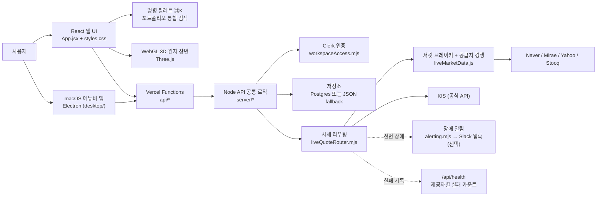
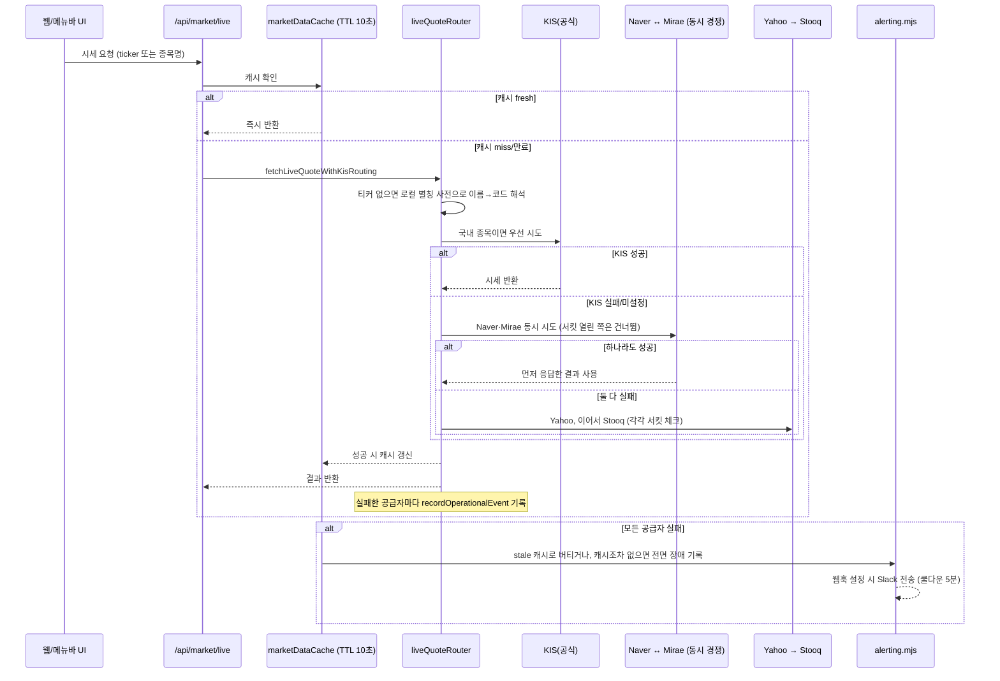

# AtomFolio 업데이트 로그

> 이 문서는 [`README.md`](../../README.md)를 대체하지 않습니다. README는 앱 자체(실행 방법, 기능,
> 아키텍처)를 설명하는 기준 문서로 그대로 두고, 이 문서는 **날짜별로 쌓이는 변경 기록**입니다.
> 최신 항목이 맨 위에 오고, 각 항목은 그 시점에 실제로 로컬에서 실행한 화면을 캡처해 붙입니다 —
> 합성하거나 상상해서 그린 스크린샷은 없습니다. 이전에는 초기 버전과 현재를 한 번에 비교하는
> 단일 문서였는데, 지금부터는 작업 단위(커밋 묶음)마다 새 항목을 위에 추가하는 방식으로 바뀝니다 —
> 예전 문서 내용은 통째로 지우지 않고 맨 아래 "베이스라인" 항목으로 그대로 남겨뒀습니다.

## 2026-08-13 — 메뉴바 위젯 상호작용 다듬기 (드래그ㆍ클릭스루ㆍ카테고리ㆍ잠자기)

바로 아래 베이스라인 항목을 쓴 직후 이어서 진행한 작업입니다. macOS 메뉴바 위젯의 상호작용을
직접 켜보면서 나온 버그/요청을 하나씩 고쳤습니다 — 실제 커밋 기준으로만 적었습니다.

### 무엇이 바뀌었나

- **원자 회전 속도**: `AUTO_ROTATE_SPEED` 0.018 → 0.022 (~22%). 데스크톱 위젯에만 적용되고
  웹사이트는 영향 없습니다(웹은 `src/App.jsx`에 자기만의 값을 따로 갖고 있음).
- **⌘+드래그 "걸림" 근본 수정**: 렌더러가 자기 창 밖 마우스 이벤트를 못 받는 게 원인이었던 걸,
  메인 프로세스가 `screen.getCursorScreenPoint()`를 16ms 주기로 직접 폴링하는 방식으로 바꿔
  화면 어디로 빠르게 끌어도 창이 커서를 놓치지 않습니다. ⌘를 뗀 즉시 멈추는 이전 수정도 유지.
- **위젯을 켤 때마다 화면 중앙에 표시**: 마지막 위치를 기억해 복원하던 걸 바꿔, 보일 때마다
  주 디스플레이 중앙에 다시 뜨도록 변경. 처음엔 탭으로 껐다 켤 때만 적용되고 **앱을 아예 새로
  실행할 때는 안 먹히는 버그**가 있어서 별도로 잡았습니다(`createAtomWidget`이
  `setAtomWidgetVisible`을 안 거치고 있었음).
- **종목 클릭 시 정보박스가 원자와 겹치던 문제**: 처음엔 반투명 검은 배경(스크림)으로 땜빵했다가,
  "검은박스 없애고 안 겹치게" 피드백을 받고 다시 고쳤습니다 — `.atom-visual-stage`에 영구적으로
  하단 52px 여백을 둬서 원자 자체가 살짝 작게/위로 그려지고, 정보박스는 배경 없이 빈 공간에
  자연스럽게 뜹니다.
- **원자 위젯 빈 공간 클릭 통과(click-through)**: 위젯은 투명 창인데 `setIgnoreMouseEvents`를
  한 번도 안 불러서, 원자 주변 빈 여백을 눌러도 뒤에 있는 다른 앱 버튼이 안 눌리던 문제를
  고쳤습니다. `document.elementFromPoint` 기반 히트테스트로 실제 상호작용 가능한 지점(노드,
  중심, ⌘+드래그 중인 배경)이 아니면 클릭이 뒤로 통과하도록 만들었습니다.
- **카테고리 필터** (설정 → 앱 설정): 자산군/지역/분야/스타일/위험 중 하나를 고르면, 원자를
  클릭했을 때 같은 값을 가진 다른 종목들과 **실선으로 연결**됩니다(처음엔 점선이었다가 피드백
  받고 실선으로 변경). 같은 카테고리 노드는 다른 노드처럼 흐려지지 않고 선택된 노드와 함께
  강조됩니다.
- **잠자기 모드**: 위젯을 완전히 비활성화해서 배경화면처럼 떠 있기만 하게 만드는 기능. 처음엔
  설정 패널에 넣었다가, "설정 말고 트레이 아이콘 우클릭 메뉴에 넣어달라"는 피드백을 받고
  `원자 위젯 표시` 체크박스 옆으로 옮겼습니다.

전부 `npm run build:renderer && npm run build:main-libs` 통과, lint 클린, 웹 앱
`npm run build`·`node --test`(78개) 영향 없음을 확인했습니다. 다만 이번 항목의 라이브 조작
검증(직접 드래그해서 안 걸리는지, click-through가 실제로 통과하는지 등)은 작업 환경 제약으로
끝까지 다 하지 못했고, 커밋 메시지에도 그렇게 정직하게 남겨뒀습니다 — 실제 사용 중 이상이
있으면 알려주세요.

### 스크린샷

이 항목의 스크린샷은 **사용자가 직접 촬영해 채워 넣기로** 했습니다(자동화로 캡처하기엔 화면에
다른 창이 많아 계속 무관한 내용이 섞여 들어갔습니다). 아래 파일을 `docs/updates/assets/`에
추가하면 이 문서에 바로 표시됩니다.

| 파일명 | 내용 |
| --- | --- |
| `assets/atomfolio-tray-menu-2026-08-13.jpg` | 메뉴바 트레이 아이콘 우클릭 메뉴 (원자 위젯 표시 / 잠자기 체크박스) |
| `assets/atomfolio-widget-dark-2026-08-13.jpg` | 원자 위젯, 다크 테마 |
| `assets/atomfolio-widget-light-2026-08-13.jpg` | 원자 위젯, 라이트 테마 (검정 원자가 실제로 보이는지) |
| `assets/atomfolio-popover-news-2026-08-13.jpg` | 팝오버 — 뉴스 페이지 |
| `assets/atomfolio-popover-settings-2026-08-13.jpg` | 팝오버 — 설정 페이지 (카테고리 필터 포함, 잠자기는 제외된 최신 구성) |

<!--
아래 4줄의 주석을 해제하면 위 표의 파일이 실제로 문서에 렌더링됩니다:

-->

---

## 2026-08-13 — 시세 복원력 + 업데이트 노트 신설 (베이스라인)

> 이 문서를 날짜별 changelog 구조로 바꾸기 전까지 있었던 단일 비교 문서(초기 버전과 현재를
> 나란히 놓고 보던 형식)를 내용 그대로 옮긴 것입니다 — 다시 쓰지 않았습니다. README 원문
> 초기 커밋부터 이 항목을 작성한 시점까지의 누적 변화를 다룹니다.

### 한눈에 보는 변화

| 구분 | 처음 (초기 커밋 기준) | 지금 |
| --- | --- | --- |
| 로그인 | 없음 — localStorage만 | Clerk 기반 이메일/비밀번호 로그인 + 게스트 workspace 승격 |
| 저장소 | localStorage뿐 | localStorage + Postgres(Neon)/JSON 파일 fallback, workspace 단위 격리 |
| 시세 소스 | Yahoo → Stooq 2단 fallback | KIS(공식) → Naver/Mirae(동시 경쟁) → Yahoo → Stooq, 서킷 브레이커 + 실패 추적 + 장애 알림 |
| 원자 시각화 | 정적 SVG 스케치 선 그림 | WebGL(Three.js) 3D 장면, 노드 형상/블룸/전환 애니메이션 여러 차례 재설계 |
| 탐색 UX | 사이드 아이콘 고정 노출 | 명령 팔레트(⌘K)로 포트폴리오 간 종목 통합 검색, 관리 테이블 뷰 분리 |
| 플랫폼 | 웹 하나 | 웹 + macOS 메뉴바 동반 앱(Electron) |
| 시장 뉴스 | Naver/Bing RSS만 | + Finnhub(선택), 페이지네이션, 캐싱, 썸네일 |
| 운영 관측성 | 없음 | `/api/health`에 제공자별 실패 카운트, 레이트리밋, 캐시 상태, 장애 알림 웹훅 |
| 테스트 | 거의 없음 | `node --test` 78개 (인증 격리, 레이트리밋, KIS 라우팅, workspace 계약 등) |

아래 절부터는 각 항목이 구체적으로 *무엇을 어떻게* 더 낫게 만들었는지를 다룹니다.

### 원자 시각화 & 탐색 UX

**처음에는** 손그림에서 출발한 2D SVG 스케치였습니다 — 중심에서 뻗어나가는 얇은 선과 끝에 붙은
작은 원, 손글씨 느낌의 라벨. 아래 초기 커밋 스크린샷(`docs/assets/atomfolio-dashboard.png`)이
그 모습입니다.

**지금은** Three.js 기반 WebGL 3D 장면입니다. 커밋 히스토리를 보면 이 부분에 가장 많은 반복이
들어갔습니다.

- **Stage A~D 단계적 재작성**: 정적 렌더링(Stage A) → 레이캐스터 상호작용 + CSS2D 라벨(Stage B)
  → 상시 블룸 + 상세 패널(Stage C) → 포트폴리오 전환 시 화면 전체가 전환되는 연출(Stage D). 처음
  구현한 "블랙홀 흡수" 연출은 이후 "우주선이 다음 포트폴리오로 날아가는" 방식으로 다시 설계되어
  방향感이 더 명확해졌습니다.
- **노드 형상 단순화**: 기울어진 5중 고리 대신 하나의 울퉁불퉁한 이코사스피어(icosphere) 보석
  형태로 정리 — 각진 아티팩트를 없애고 구체 셰이딩을 더 매끄럽게 다듬었습니다.
  대신 노드 형상 렌더링 이슈들을 함께 정리했습니다.
- **명령 팔레트(⌘K)**: 지금은 이름·티커로 검색하면 **모든 포트폴리오를 가로질러** 한 번에 결과가
  뜹니다(아래 스크린샷 참고) — 원래는 활성 포트폴리오 안에서만 찾을 수 있었습니다.
- **관리(관리 탭) 테이블 뷰**: 3D 장면과 별개로 종목명·티커·매수가·수량·수익률·자산군을 표 형태로
  바로 편집할 수 있는 화면이 분리되어, 대량 수정이 3D 조작보다 훨씬 빨라졌습니다.
- **신규 유저 온보딩**: 빈 포트폴리오 상태에서 무엇을 눌러야 할지 안내하는 empty-state CTA와 ⌘K
  발견성 힌트를 추가 — 첫 방문자가 화면만 보고 막히는 문제를 줄였습니다.

### 인증 & 워크스페이스 (완전히 새로 생긴 계층)

원래 버전에는 로그인이라는 개념 자체가 없었습니다 — 브라우저 localStorage가 전부였고, 기기를
바꾸면 데이터가 사라졌습니다. 지금은:

- **Clerk** 기반 이메일/비밀번호 로그인(커스텀 UI, headless `useSignIn`/`useSignUp` 훅으로 직접
  그림)이 추가됐고,
- 로그인 전에도 `guest:<uuid>` workspace로 즉시 쓸 수 있다가, 로그인하면 게스트 데이터가 그대로
  로그인 계정 workspace로 옮겨지며(`/api/workspace/claim-guest`),
- 서버는 Clerk JWT를 `@clerk/backend`의 `verifyToken`으로 검증해 다른 사용자의 workspace에
  접근할 수 없다는 것을 **테스트로 직접 확인**해 두었습니다
  (`a different authenticated user cannot access another owner workspace`).
- 저장소도 localStorage 단독에서 **Postgres(Neon) 또는 JSON 파일 fallback**으로 이중화됐습니다.

### 실시간 시세 신뢰성

이 항목을 쓴 세션에서 가장 집중적으로 작업한 영역입니다. "시세 데이터 커버리지/안정성을
어떻게 높일까"라는 질문에서 시작해, **비용이 들지 않는 범위 안에서** 아래 다섯 가지를 실제
코드로 구현했습니다 (`src/lib/liveMarketData.js`, `server/marketData/liveQuoteRouter.mjs`,
`server/marketDataCache.mjs`, `server/alerting.mjs`).

| 문제 | 이전 | 지금 |
| --- | --- | --- |
| 죽은 공급자를 매번 기다림 | Naver가 막혀 있어도 매 요청마다 처음부터 다시 타임아웃까지 기다림 | 연속 3회 실패한 공급자는 30초간 자동으로 건너뜀 (서킷 브레이커) |
| Naver/Mirae 순차 대기 | Naver 실패를 기다린 **다음에야** Mirae 시도 | 서로 독립적인 두 소스를 동시에 시도해 먼저 응답한 쪽을 사용 (`raceQuoteAttempts`) |
| 공급자 실패가 안 보임 | 모든 공급자가 동시에 실패할 때만 로그 한 줄 | 공급자별 실패가 전부 기록되어 `/api/health?details=events`에 `provider-fail:naver` 식으로 집계 |
| 전면 장애를 아무도 모름 | stale 응답만 나가고 알림 없음 | `server/alerting.mjs`가 전면 장애를 감지해 기록하고, 원하면 Slack 웹훅으로도 전송 (`ATOMFOLIO_ALERT_WEBHOOK_URL`, 무료) |
| 종목명만 있는 국내 종목은 공식 소스(KIS)를 못 탐 | 티커가 있을 때만 KIS 시도 | 오프라인 로컬 별칭 사전으로 이름→코드를 먼저 풀어, 이름만 있어도 KIS를 먼저 시도 |

이 다섯 가지는 모두 **새 유료 API 계약 없이** 기존 무료/공식 소스를 더 똑똑하게 쓰는 방향의
개선입니다. 테스트는 78개로 늘었고(신규 테스트 1개 포함), 빌드·lint 모두 통과를 확인했습니다.
자세한 동작은 README의 "API 남용 방어" 절에도 반영해 두었습니다.

### CSV 인제스천 안정성

원래도 CSV 자동 추론은 핵심 기능이었지만, 실제 사용 데이터를 더 넣어보면서 몇 가지 구체적인
버그가 드러나고 고쳐졌습니다.

- **이름 패턴으로 종목이 조용히 사라지던 문제**: 특정 이름 패턴의 종목이 재검사 단계에서
  걸러져 원자 화면에 아예 안 뜨던 버그를 고침(`Fix stocks silently dropped from atom scene by
  name-pattern re-check`).
- **수동 생성 포트폴리오 이름에 `.manual.csv`가 자동으로 붙던 문제**를 제거 — 사용자가 직접
  이름을 입력했는데 뒤에 이상한 접미사가 남는 문제였습니다.
- **날짜 기준 설정이 히트맵/뉴스 타임스탬프에 반영 안 되던 버그**를 고침.
- **`PortfolioAllocationCard`가 `className` prop을 누락하던 버그**를 고침(비중 도넛 레이아웃이
  깨지는 원인이었습니다).

### 라이트/다크 모드 — 시도했다가 되돌린 사례

한 시점에는 시스템/라이트/다크 3가지 테마 설정이 실제로 존재했습니다. 라이트 모드에서 원자
색상이 거의 안 보이는 문제, 후광과 알파 블렌딩이 비대칭으로 겹치는 문제 등을 몇 커밋에 걸쳐
고쳤지만, 최종적으로는 **다크 모드 단일화로 되돌렸습니다**(`Remove light/dark theme toggle
entirely — dark is the only mode again`). 실패가 아니라, 원자 시각화라는 이 앱의 정체성에는
어두운 배경이 본질적으로 더 맞는다는 판단이 실험을 통해 확인된 사례로 봅니다.

> 참고: 이건 **웹사이트**의 라이트/다크 이야기입니다. **메뉴바 위젯**은 이 결정과 별개로 지금도
> 시스템/라이트/다크 테마 설정을 그대로 갖고 있습니다 — 바로 위 항목의 스크린샷에서 라이트
> 테마의 검정 원자를 확인할 예정인 이유입니다.

### 완전히 새로운 플랫폼 — macOS 메뉴바 동반 앱

원래 AtomFolio는 웹 하나였습니다. 지금은 `desktop/` 아래에 **별도의 Electron 프로젝트**가
추가되어, 웹/서버 코드를 건드리지 않고 기존 API(`/api/portfolio`, `/api/market/news`)를 그대로
재사용하는 macOS 메뉴바 앱이 생겼습니다.

#### 무엇을 하는 앱인가

- 메뉴바에 원자 모양 트레이 아이콘이 뜨고, 클릭하면 **보유 비중 상위 종목이 포트폴리오 총액을
  중심으로 도는 원자 궤도**가 별도의 작은 위젯 창으로 뜹니다. 드래그로 궤도를 돌리거나, 가만히
  두면 천천히 자동으로 돕니다.
- 종목 하나를 클릭하면 그 종목의 평가금액·손익·비중이 표시되고, 다시 클릭하면 전체 총액으로
  돌아옵니다.
- 트레이 아이콘 자체는 손익 방향에 따라 빨강(수익)/파랑(손실)/중립 점으로 바뀝니다
  (`trayDot-profit.png` / `trayDot-loss.png` / `trayDot-neutral.png`, 2x 레티나 포함) — macOS가
  강제로 단색 처리하는 "Template" 이미지 네이밍을 일부러 피해서, 색이 실제로 보이게 만들었습니다.
- 팝오버 안에는 뉴스 검색과 설정 페이지가 카드 스와이프로 전환되는 페이저(pager)로 들어가
  있습니다.
- 60초 폴링으로 종목 뉴스를 확인해 데스크톱 알림을 띄웁니다(완전한 실시간은 아니며, 공용 API에
  부하를 주지 않도록 폴링 주기는 60초 미만으로 내려가지 않게 강제되어 있습니다).
- 정식 OAuth 로그인은 아직 없고, 웹의 게스트/workspaceId 체계를 그대로 재사용합니다 — 웹
  설정(설정 → Workspace)에 뜨는 Workspace ID를 붙여넣으면 연결됩니다.

#### 여기까지 오는 동안 고친 것들

메뉴바 앱도 여러 차례 반복을 거쳤습니다 — 위젯이 Spaces/전체화면 전환 중에 사라지던 버그,
⌘+드래그로 창이 실제로는 안 움직이던 버그, 패키징된 앱이 조용히 크래시하며 창이 아예 안 뜨던
버그, 회전/이동 제스처가 서로 충돌하던 문제 등을 각각 별도 커밋으로 고쳤습니다(그 다음 라운드의
드래그·클릭스루·카테고리·잠자기 작업은 위 최신 항목 참고). 지금은 Apple Silicon(arm64) 전용으로
빌드 타겟을 좁혀 배포 안정성을 확보한 상태입니다.

#### 스크린샷에 대해 밝혀둘 것

메뉴바 앱은 macOS 네이티브 트레이 위젯이라 처음에는 브라우저 자동화로 캡처가 안 됐습니다.
그래서 로컬에서 실제로 `cd desktop && npm run dev`로 앱을 띄우고, macOS 기본 `screencapture`
명령으로 직접 캡처했습니다 — 아래 세 장은 목업이 아니라 **실제 macOS 데스크톱에서 실행 중인
진짜 트레이 위젯/팝오버**이고, 로컬 API(`localhost:8787`)에 연결된 실제 테스트 워크스페이스의
포트폴리오(`portfolio_test2`, 11개 종목)와 실시간 Naver 증시뉴스가 그대로 붙어 있습니다.

다만 이 과정에서 한 번 화면을 전체로 캡처해 무관한 다른 앱 창(카카오톡 대화, 메모 앱 등)이
같이 찍힌 적이 있었는데, **그 파일은 어디에도 저장하거나 첨부하지 않고 즉시 삭제**했습니다.
이후로는 캡처 직전에 카카오톡·메모·Finder 등 관련 없는 앱 창을 macOS `System Events`로
잠깐 숨겨두고, 사용자가 지정한 Chrome(Google) 창이 떠 있는 화면에서만 다시 캡처한 뒤 바로
원상 복구하는 방식으로 진행했습니다. 아래 이미지들은 그렇게 얻은, 무관한 개인정보가 섞이지
않은 캡처만 골라 자른 것입니다.

**원자 위젯** — 항상 위에 떠 있는 별도 창으로, 보유 종목이 포트폴리오 총액을 중심으로 도는 궤도입니다. 배경에 사용자의 실제 Chrome 창(GitHub의 AtomFolio 저장소, YouTube 탭)이 비쳐 macOS 데스크톱 위에 진짜로 떠 있다는 걸 보여줍니다:

**팝오버(뉴스/빠른 추가/설정 페이저)** — 트레이 아이콘을 누르면 뜨는 패널. `portfolio_test2 · 11개 종목`에 실시간 Naver 증시뉴스가 붙어 있는 걸 볼 수 있습니다:

**두 창이 함께 떠 있는 전체 맥락** — 사용자가 지정한 대로, Google 홈페이지가 열린 Chrome 창 위에 원자 위젯과 팝오버가 동시에 떠 있는 실제 데스크톱 화면입니다:

(참고: 위 세 장을 찍은 시점 기준 스크린샷이며, 종목 클릭 시 정보박스가 원자와 겹치던 문제는
이후 최신 항목에서 고쳐졌습니다 — 지금 모습은 최신 항목의 스크린샷을 참고하세요.)

### 스크린샷 비교 — 초기 버전 대비

#### 원자 화면

**초기 커밋** (`docs/assets/atomfolio-dashboard.png`): 손그림에서 출발한 얇은 선과 작은
원 노드, 왼쪽에 X/즐겨찾기/왕관/육각형/원형 아이콘이 세로로 고정 배치되어 있었습니다.

**현재** (이 항목 작성 시점, 로컬 실행 캡처): 같은 "중심에서 뻗어나가는 구조"라는 컨셉은
유지하면서도, 상단에 탐색/관리 탭과 명령 팔레트(⌘K)가 생겼고, 왼쪽 아이콘 rail은 포트폴리오
목록·종목 조회·요약·비교·시뮬레이션·뉴스·설정으로 재구성됐습니다.

#### 요약 도구 (히트맵 + 포트폴리오 점수 + 비중)

**지금**: 카테고리 필터, 서비스 분석 통계, 날짜별 손익 히트맵, 6축 포트폴리오 점수 레이더,
자산 비중 도넛이 한 패널에 함께 들어갑니다.

#### 투자 시뮬레이션

#### 시장 뉴스 (실시간 Naver 증시뉴스 연동 확인)

#### 명령 팔레트 (⌘K) — 포트폴리오 전체 통합 검색

같은 종목명이라도 어느 포트폴리오 소속인지(`테스트계좌.manual`, `demo-portfolio` 등) 함께
보여주며, 여러 포트폴리오에 흩어진 종목을 한 번에 찾을 수 있습니다.

#### 설정

### 아키텍처 — 이 항목 기준

README의 원래 아키텍처 다이어그램에 이 항목에서 추가된 계층(서킷 브레이커, 공급자 경쟁, 장애
알림, KIS 이름 라우팅)과 새 플랫폼(메뉴바 앱)을 더해 다시 그리면 다음과 같습니다.

### 시세 조회 흐름 — 이 항목에서 새로 생긴 복원력 계층

## 참고

- 앱 자체에 대한 설명은 [`README.md`](../../README.md)를 참고하세요.
- 메뉴바 앱 실행 방법은 [`desktop/README.md`](../../desktop/README.md)를 참고하세요.
- 이 문서의 English 버전: [`AtomFolio_Updates.en.md`](AtomFolio_Updates.en.md)
